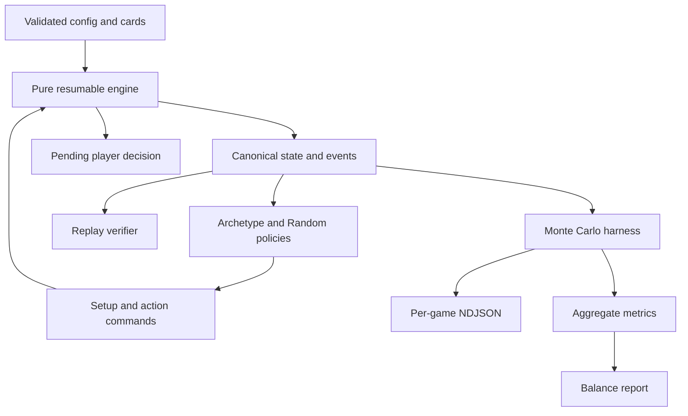
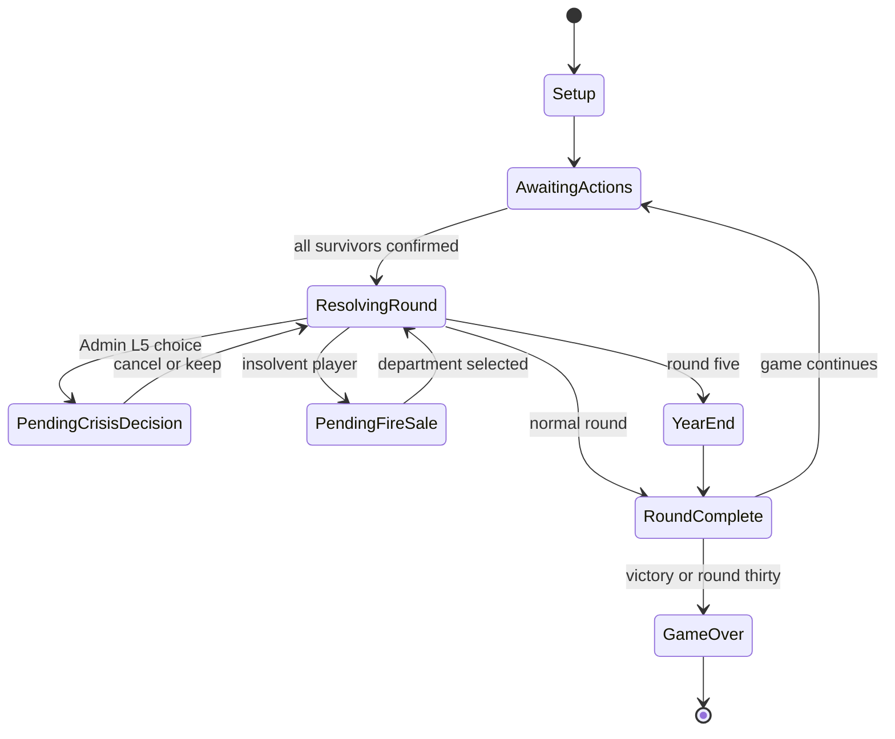
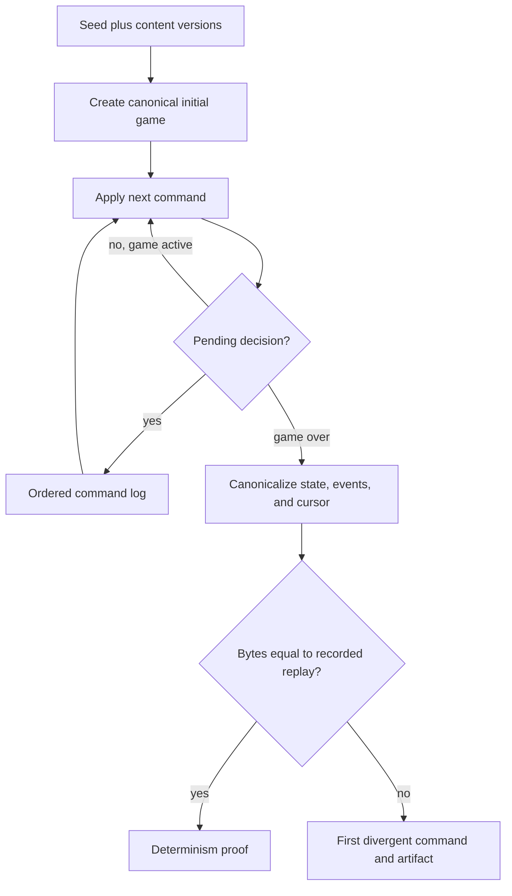

# Safety School Phase 1 Engine and Balance Harness - Plan

## Goal Capsule

- **Objective:** Deliver the deterministic, headless Phase 1 game engine, six simulation agents, replay tooling, and a balance report that passes the documented acceptance criteria with programs both enabled and disabled.
- **Authority:** `balance-config.json` owns numbers; `resolution-order.md` owns mechanics; `cards.json` owns content and closed effect vocabularies; `SAFETY-SCHOOL-GOING-CONCERN-DESIGN.md` owns intent; this plan records the confirmed resolutions where those sources currently contradict one another.
- **Execution profile:** Implement U1-U7 in dependency order. Keep the engine free of UI, network, clock, storage, and agent-policy concerns.
- **Stop conditions:** Stop for a newly discovered product-rule conflict that cannot be resolved by the authority order. Do not change engine behavior to improve balance statistics; tune only `balance-config.json` after the engine is proven correct.
- **Completion signal:** Tests pass, deterministic replay is byte-identical, at least 10,000 balanced games per `programsEnabled` branch meet every acceptance threshold, Random fuzzing finds no unresolved or overlong game, and the generated report records the evidence.

---

## Product Contract

### Summary

Phase 1 establishes Safety School as a deterministic rules system before any interface or multiplayer code exists. It includes the complete round and year lifecycle, scripted and Random agents, reproducible simulation, replay verification, and config-only balance tuning.

### Problem Frame

The product documents describe a strategy-heavy multiplayer board game whose later clients and server must agree on every outcome from the same seed and action history. The target GitHub repository is empty, so there are no implementation patterns to extend and no existing tests to preserve.

The design package is substantial but not executable as written. It contains stale titles and completion notes, an RNG contradiction between pre-shuffled decks and per-card selection draws, a same-round Fortune effect scheduled after recruiting, and a persistence snapshot placed before year-end mutations. Phase 1 must reconcile those points before engine code can be judged against one authoritative contract.

### Requirements

**Rules and determinism**

- R1. The engine is a pure deterministic transformation of prior state, submitted commands, validated content, and an explicit RNG cursor, returning new state, ordered events, the next RNG cursor, and any pending decision.
- R2. The engine implements setup, all round steps, all year-end steps, elimination, inheritance, and victory for two through five players without reading the clock, network, filesystem, UI state, or agent policies during resolution.
- R3. Every numeric game value comes from `balance-config.json`; engine code may implement named algorithms but may not duplicate tunable constants.
- R4. Every Fortune, Crisis, Headline, Disruption, and Program effect in `cards.json` and `balance-config.json` resolves through a closed, validated vocabulary without dynamic evaluation.
- R5. Admin L5 cancellation and forced austerity sales are resumable deterministic decisions recorded in the action log, not callbacks hidden inside engine execution.
- R6. `programsEnabled: false` rejects program-opening actions and makes every program effect or rider inert while leaving all other rules unchanged.

**Simulation and agents**

- R7. Five archetype agents and one Random agent can create legal setup choices, allocation actions, Admin cancellation decisions, and forced-sale decisions using only information the corresponding player is entitled to know.
- R8. The Monte Carlo harness runs a fixed, seeded, balanced lineup matrix across two through five players, seat positions, archetypes, and both program branches.
- R9. Each program branch runs at least 10,000 scored games; a separate Random-agent fuzz run covers at least the configured minimum and rejects games that exceed 30 rounds or remain unresolved.
- R10. Balance failures produce config-only tuning proposals or changes followed by a complete rerun; engine logic is never changed to force a target metric.

**Evidence and handoff**

- R11. Any recorded seed and action log can be replayed to a byte-identical final canonical state, event stream, and RNG cursor.
- R12. Simulation emits compact per-game NDJSON, a machine-readable aggregate, and a human-readable balance report covering every criterion and both program branches.
- R13. The canonical product name is Safety School throughout metadata and active documentation; retired names and stale “content pending” statements are removed.

### Key Flows

- F1. Deterministic game resolution
  - **Trigger:** A caller creates a game or submits the next legal command batch.
  - **Steps:** The engine validates input, advances through deterministic steps, consumes RNG only at registered call sites, stops for a player decision when required, and otherwise returns the completed round state and events.
  - **Outcome:** The caller receives a replayable state transition with no hidden side effects.
  - **Covered by:** R1-R6.
- F2. Replay proof
  - **Trigger:** A seed and complete action log from a prior game are supplied.
  - **Steps:** The replay tool creates the same initial state, reapplies commands in order, and canonicalizes each final artifact.
  - **Outcome:** Exact byte equality passes, or the first divergent command and artifact are reported.
  - **Covered by:** R1, R11.
- F3. Balance verification
  - **Trigger:** The Phase 1 simulation command runs.
  - **Steps:** The harness schedules balanced lineups, runs both program branches, records results, evaluates thresholds, and generates reports.
  - **Outcome:** Every criterion is green, or the report identifies the failing metrics and the config-only tuning loop continues.
  - **Covered by:** R7-R12.

### Acceptance Examples

- AE1. Given the same content versions, seed, setup, and command log, when two fresh replays run, then their canonical state, events, and RNG cursor are byte-identical.
- AE2. Given a shuffled Fortune deck whose top card has a fixed target, when the card resolves, then no RNG value selects the card and exactly one RNG value is consumed for the target slot even though the fixed target discards it.
- AE3. Given a Fortune card with `bonusConversionsThisRound`, when it resolves after recruiting, then students are added immediately outside pool scaling before strain and elimination checks.
- AE4. Given an uncancelled severity-two Crisis and an eligible Admin L5 player, when resolution reaches that card, then the engine returns a pending cancel-or-keep decision and resumes without repeating earlier RNG draws after the decision command arrives.
- AE5. Given a round-five resolution, when the public standings step and year-end sequence finish, then the standings event reflects its documented pre-year-end position while the persisted replay snapshot contains all year-end mutations.
- AE6. Given `programsEnabled: false`, when a player attempts to open a program or a card contains a program rider, then the action is invalid and the rider is a deterministic no-op.
- AE7. Given simultaneous final-round eliminations that leave no survivors, when inheritance and victory resolve, then casualties do not inherit from each other and the highest Institutional Health Score among that round's casualties wins.

### Success Criteria

- Every archetype owns 15%-30% of winners in each branch's balanced lineup schedule; Random owns less than 8%.
- Median completion is round 22-28, no more than 15% finish before round 16, and no more than 40% reach the Year 6 tiebreak.
- Players entering forced austerity survive to the game end 25% +/- 8% of the time.
- With programs enabled, each program appears in at least 10% and no more than 60% of winning portfolios.
- Every scored replay is byte-identical, no game exceeds 30 rounds, and the Random fuzz suite produces no unresolved state.

### Scope Boundaries

**In scope**

- Reconcile the existing rules package where implementation is currently blocked.
- Build the complete Phase 1 engine, agents, simulator, replay tool, validation, tests, generated logs, and balance report.
- Tune only numeric configuration until both program branches pass.

#### Deferred to Follow-Up Work

- Phase 2 browser UI, hotseat play, and interactive solo play.
- Phase 3 Supabase schema, auth, lobbies, server-authoritative resolution, realtime updates, secrecy policies, and reconnect behavior.
- Phase 4 animation, sound, timed mode, spectators, and institutional-history presentation.
- Parallel simulation with worker threads unless a measured single-process run makes the tuning loop impractical.

### Product Contract Preservation

Core product behavior is unchanged. Confirmed clarifications are limited to the canonical title, top-deck card draws after shuffling, immediate same-round Fortune conversions, balanced simulation sampling, and post-year-end persistence snapshots.

---

## Planning Contract

### Key Technical Decisions

- **KTD1. Canonical title:** Safety School is the only active product name. (session-settled: user-directed — chosen over Safety School: Going Concern and Last University Standing: the shorter title better preserves the satirical tone.)
- **KTD2. Phase boundary:** This plan delivers Phase 1 only. (session-settled: user-directed — chosen over planning through multiplayer or all four phases: the engine and balance model must be proven before interface and backend work.)
- **KTD3. Runtime:** Use Node 24 LTS, ECMAScript modules, `node:test`, `node:assert/strict`, and other built-in APIs. Add no production or test dependency; the installed runtime and stable standard library already cover this phase.
- **KTD4. Reducer boundary:** Expose a pure resumable engine. It advances until the round completes or a rule requires a decision, then returns a pending-decision state that can only accept the matching next command. This preserves human choices for later multiplayer without putting callbacks or AI knowledge inside the engine.
- **KTD5. RNG and decks:** Use one small in-repo Mulberry32 implementation with explicit state and cursor. Shuffle decks in the documented order with Fisher-Yates, then draw from the top; only shuffles consume card-order RNG. (session-settled: user-directed — chosen over randomly selecting every card or consuming unused draw values: one shuffle plus top-deck draws gives the clearest replay tape.)
- **KTD6. Fixed-target discipline:** Fortune and Crisis cards always consume one target RNG value, even for fixed targets, so every player card consumes the same target-tape shape. Card selection itself consumes no RNG after a shuffle.
- **KTD7. Same-round conversions:** Apply `bonusConversionsThisRound` immediately during Chance, outside the shared pool, before strain and elimination. (session-settled: user-directed — chosen over delaying the effect or moving Chance before recruiting: the card keeps its stated timing without disturbing the round order.)
- **KTD8. Executable config:** Treat formula and rule strings as validated identifiers mapped to reviewed engine algorithms; never pass content to `eval` or `Function`. Numeric operands remain config-owned.
- **KTD9. Persistence boundary:** Emit public standings at its documented point, then canonicalize the replay snapshot only after any year-end sequence finishes. (session-settled: user-approved — chosen over persisting the incomplete pre-year-end state: one snapshot must represent the complete round transaction.)
- **KTD10. Simulation sampling:** Use a deterministic stratified schedule with balanced archetype, seat, and player-count exposure, and calculate archetype success as winner share within each program branch. (session-settled: user-approved — chosen over unconstrained random lineups: comparable exposure makes the acceptance bands meaningful.)
- **KTD11. Balance isolation:** Agent policy code is versioned and fixed during a scored run. Game RNG never powers AI choices; each agent receives a separate derived policy seed, while replay depends only on the resulting action log.
- **KTD12. Canonical evidence:** Serialize plain JSON-compatible artifacts with recursively stable object-key order. Replay proof compares bytes in addition to strict structural equality.
- **KTD13. Versioned replay envelope:** Every setup, action log, snapshot, and report carries a state-schema version plus digests of the effective config, cards, and agent-policy version. Replay rejects mismatched identities before applying commands instead of reporting a false determinism failure.
- **KTD14. One-way dependencies:** `engine/` imports only validated content and built-in APIs; `agents/` uses the engine's public observation/command contract; `sim/` orchestrates both. The engine never imports agents, simulation, reports, or generated artifacts.

### High-Level Technical Design

#### Component topology



#### Engine lifecycle



#### Replay and verification flow



### Initialization and Sequencing Decisions

- Round 1 begins with seat 1 holding priority; later rounds rotate once at setup.
- Game setup validates the three free upgrade levels and two-level-per-department cap before any deck or rule resolution.
- Decks shuffle once in Fortune, Crisis, Headline, Disruption order. The first public annual disruption is drawn from the shuffled top for Year 2 during setup; later year-end reveals advance the same deck.
- The engine returns events in resolution order and never relies on object iteration order to select players, departments, or effects.
- A year-end round has one persistence boundary after the complete year-end sequence; the earlier standings publication remains an event, not a durable replay checkpoint.
- State schema and content digests are fixed at game creation and repeated in replay/report envelopes; a caller cannot swap config or cards during an active game.

### Output Structure

```text
agents/
  index.js
engine/
  content.js
  index.js
  rng.js
  rules.js
reports/
  phase-1-balance.json
  phase-1-balance.md
  phase-1-games.ndjson
sim/
  replay.js
  report.js
  run.js
test/
  agents.test.js
  chance-effects.test.js
  content-contract.test.js
  engine-setup.test.js
  replay.test.js
  round-resolution.test.js
  simulation.test.js
  year-end.test.js
package.json
```

Existing source documents and JSON files remain at the repository root for Phase 1. Moving them solely to match the aspirational tree in `BUILD-PLAN.md` would add churn without improving the engine.

### Risks and Mitigations

| Risk | Consequence | Mitigation |
|---|---|---|
| Rules drift between prose, config, and content | Replays are deterministic but wrong | U1 reconciles known conflicts and makes content validation the first gate. |
| Hidden RNG consumption | A small refactor invalidates every replay | Centralize RNG calls, expose the cursor, assert per-scenario cursor deltas, and forbid agent use of game RNG. |
| Partial mutation before a pending decision | Resume repeats effects or draws | Return immutable state at explicit decision boundaries and test resume against a one-shot equivalent. |
| Formula strings become executable content | Security and cross-runtime inconsistency | Validate known identifiers and map them to engine functions; never evaluate arbitrary strings. |
| Biased lineup generation | Archetype win bands look healthy or unhealthy for the wrong reason | Use a fixed stratified schedule and report seat/player-count breakdowns beside aggregate winner share. |
| Tuning hides a logic defect | Config changes compensate for an incorrect engine | Complete deterministic rule tests before scored simulation and prohibit engine changes during the tuning loop. |
| Per-game logs become unwieldy | Slow iteration and noisy version control | Write compact one-record-per-game NDJSON; keep full command logs only for replay samples and failures. |
| Replay inputs use different content | Valid runs appear nondeterministic or silently compare different rules | Record schema/content digests and reject identity mismatches before replay. |

### Sources and Research

- Product sources: `README.md`, `BUILD-PLAN.md`, `SAFETY-SCHOOL-GOING-CONCERN-DESIGN.md`, `resolution-order.md`, `balance-config.json`, and `cards.json`.
- Repository state: [turkanaboy/safetyschool](https://github.com/turkanaboy/safetyschool) is empty at planning time; this is a greenfield implementation.
- Runtime choice: [Node.js release status](https://nodejs.org/en/about/previous-releases) identifies Node 24 as LTS.
- Test tooling: the [Node.js test runner](https://nodejs.org/api/test.html) and [strict assertions](https://nodejs.org/api/assert.html) are stable and cover Phase 1 without a test dependency.

---

## Implementation Units

### U1. Reconcile the rules package and establish the Node contract

- **Goal:** Make the existing documents and JSON inputs one executable, validated source of truth before game logic is added.
- **Requirements:** R3, R4, R10, R13; KTD1-KTD3, KTD5-KTD8.
- **Dependencies:** None.
- **Files:** `README.md`, `BUILD-PLAN.md`, `SAFETY-SCHOOL-GOING-CONCERN-DESIGN.md`, `resolution-order.md`, `balance-config.json`, `cards.json`, `package.json`, `.gitignore`, `engine/content.js`, `test/content-contract.test.js`.
- **Approach:** Replace retired titles and stale pending-content notes; record the confirmed shuffle and same-round conversion rules; move every numeric acceptance threshold currently stranded in prose into `simulationAcceptanceCriteria`; define an ESM package targeting Node 24; and validate config/card shape, counts, IDs, references, probability tables, closed vocabularies, and allowed rule identifiers. Preserve the current root locations to avoid an unrelated move.
- **Patterns to follow:** The authority hierarchy and closed-vocabulary rules already documented in `README.md` and `cards.json`.
- **Test scenarios:**
  1. The unmodified canonical config and cards load successfully and produce immutable normalized content.
  2. A duplicate card ID, unknown effect type, missing referenced program, invalid department, deck-count mismatch, or probability table that does not total one is rejected with the offending path.
  3. An unknown formula/rule identifier is rejected rather than evaluated.
  4. All acceptance criteria required by `BUILD-PLAN.md` are present in the authoritative config, including Random, portfolio-frequency, determinism, maximum-round, and fuzz thresholds.
- **Verification:** Content validation succeeds from a clean checkout and every deliberately corrupted in-memory fixture fails the expected contract check.

### U2. Build deterministic setup, RNG, and canonical state foundations

- **Goal:** Create valid initial games and reproducible deck/state artifacts with explicit RNG accounting.
- **Requirements:** R1-R4, R6, R11; AE1, AE2, AE6; KTD4-KTD6, KTD12-KTD14.
- **Dependencies:** U1.
- **Files:** `engine/rng.js`, `engine/index.js`, `test/engine-setup.test.js`.
- **Approach:** Implement Mulberry32 state/cursor handling, Fisher-Yates shuffling, half-even money persistence, stable canonical serialization, versioned content digests, setup validation, fixed seat order, priority initialization, initial player resources, free upgrades, deck state, and the first public Year 2 disruption reveal. Keep caller inputs unmodified and bind the effective content identity for the game's lifetime.
- **Execution note:** Start with deterministic setup and cursor-delta tests before adding later rule phases.
- **Test scenarios:**
  1. Covers AE1. Two games created from identical inputs have byte-identical state, deck order, and RNG cursor; a different seed changes the shuffled order.
  2. Covers AE2. Initial shuffle cursor consumption matches the exact Fisher-Yates swap count in the documented deck order; drawing a top card consumes no card-order RNG.
  3. Two through five players are accepted; all other player counts fail before RNG is consumed.
  4. Setup accepts exactly three free levels with no more than two assigned to one department and rejects every over-allocation.
  5. Round 1 assigns priority to seat 1 and setup reveals the Year 2 disruption without exposing later secret information.
  6. Half-even persistence covers positive and negative half-cent boundaries without changing full-precision intermediate calculations.
  7. Mutating a returned state does not mutate the prior input or validated content.
  8. A game transition accepts matching schema/content digests and rejects a changed config, card set, or schema version before any command or RNG use.
- **Verification:** A stored setup fixture can be regenerated exactly from its seed and setup commands, including cursor and canonical bytes.

### U3. Implement action validation, economy, and recruiting

- **Goal:** Resolve round setup through recruiting with simultaneous commitments and the complete shared-pool model.
- **Requirements:** R1-R6; F1; KTD4, KTD8.
- **Dependencies:** U2.
- **Files:** `engine/index.js`, `engine/rules.js`, `test/round-resolution.test.js`.
- **Approach:** Add the resumable round driver and Steps 1-6: effect cleanup, priority rotation, Headline reveal, income/upkeep, allocation validation, action-type resolution, program opening, poaching, campaigns, pull classes, Nursing reservation, proportional pool scaling, yields, and student updates. Map config rule identifiers to explicit algorithms and apply modifiers in the documented order.
- **Execution note:** Implement the round driver test-first around complete state transitions rather than testing private helpers.
- **Test scenarios:**
  1. Zero committed actions behaves as Bank, while more than two actions, duplicate action types, unaffordable total spend, illegal Admissions timing, and level overflow are rejected without partial mutation.
  2. Voluntary sale proceeds cannot fund another action committed in the same round, but do land before later rule phases.
  3. An Academics upgrade takes effect immediately for capacity but does not create a same-round program slot; a valid program opening takes effect for current recruiting.
  4. Two players poaching the same eligible target both receive the independently calculated transfer, and an ineligible target rejects the action.
  5. Zero total scalable pull skips division; oversubscribed pull scales proportionally; unused allotment expires.
  6. Nursing reserves off-the-top pull without reputation or pool scaling, including the pathological case where its reservation exhausts the allotment.
  7. Campaign RNG is consumed only by campaigning survivors in seat order, and the Admissions floor clamps the configured uniform yield.
  8. Headlines modify only their named current-round phases and expire on the next round setup.
  9. With programs disabled, open-program is invalid and every program contribution remains absent.
- **Verification:** Seeded fixtures cover normal, undersubscribed, oversubscribed, and programs-disabled rounds with exact state, event, and cursor expectations.

### U4. Implement Athletics, cards, decisions, strain, and austerity

- **Goal:** Complete round Steps 7-10, including every closed-vocabulary effect and both mid-resolution player decisions.
- **Requirements:** R1-R6; AE2-AE4, AE6; KTD4-KTD8.
- **Dependencies:** U3.
- **Files:** `engine/index.js`, `engine/rules.js`, `test/chance-effects.test.js`.
- **Approach:** Resolve Athletics seasons, player cards, weighted targets, scalable and non-scalable effects, program riders, Admin mitigation, same-round conversions, strain, forced sales, elimination candidates, and pending-decision resume. An effect dispatcher handles only validated vocabulary entries. A pending decision captures enough logical position to resume without repeating any prior event or RNG use.
- **Execution note:** Prove pause/resume equivalence for Admin and austerity before filling out the remaining card vocabulary.
- **Test scenarios:**
  1. Great, Good, and Losing Athletics seasons resolve their configured outcomes; Losing queues exactly one fixed-target extra Crisis after the normal Crisis.
  2. Fortune resolves before Crisis for each player, and players resolve in seat order while eliminated players consume no later RNG.
  3. Covers AE2. Fixed-target and random-target cards each consume one target RNG value; Arts and Sciences changes only that player's weighted Crisis mapping.
  4. Admin L2 reduces severity to a minimum of one; Covers AE4 for both Admin L5 cancel and keep responses, including cursor stability across resume.
  5. Covers AE3. Same-round conversions add students immediately and participate in that round's strain and enrollment-elimination checks.
  6. Every player-card effect type and program rider has at least one positive or negative fixture proving scaling, timing, expiry, and caps.
  7. Forced sale choices repeat until solvent or every department reaches level one; each sale applies the configured recovery and reputation penalty, and programs remain unsellable.
  8. A voluntary sale changes the target level used by a later card in the same round.
  9. Pending decisions from different players never interleave with incomplete card resolution.
  10. An active race Disruption awards only the first qualifying player; simultaneous qualification uses priority proximity and later qualifiers receive nothing.
  11. A command for the wrong decision type or player is rejected without changing state, events, or RNG cursor; the matching command then resumes normally.
- **Verification:** All 72 player cards can resolve in a seeded matrix without an unknown effect, invalid state, repeated event, or unregistered RNG call.

### U5. Implement year-end, inheritance, victory, and complete snapshots

- **Goal:** Finish every round and game with correct year-end mutations, elimination handling, and replay boundaries.
- **Requirements:** R1-R6, R9, R11; AE5-AE7; KTD9, KTD12.
- **Dependencies:** U4.
- **Files:** `engine/index.js`, `engine/rules.js`, `test/year-end.test.js`.
- **Approach:** Add standings events, graduation, attrition, donations/grants, disruption activation and reveal, demographic progression, the safety net, post-year-end elimination, inheritance, last-survivor victory, zero-survivor scoring, and the Year 6 Health Score. Complete the round snapshot only after year-end and include programs in the score as documented.
- **Test scenarios:**
  1. Graduation floors seniors and graduates at state-write boundaries; attrition applies the pre-penalty cap, accumulated strain, card effects, and program bonuses in order.
  2. Alumni donations include Academics and Engineering, apply annual multipliers, and exclude Public Affairs grants from donation multipliers.
  3. The first public disruption applies to Year 2; later public and Admin-private reveals advance one year without repeats.
  4. The lowest eligible treasury receives the one-time safety net, ties resolve deterministically, and prior recipients cannot receive it again.
  5. Simultaneous casualties are identified before inheritance, floors and remainder loss are deterministic, and casualties never inherit.
  6. Covers AE7. Zero survivors use final-round casualty Health Scores; a single survivor wins immediately.
  7. A round-five attrition drop below 1,000 triggers the post-year-end elimination check before the next round.
  8. Covers AE5. Public standings precede year-end, while the canonical snapshot and cursor include every year-end mutation.
  9. Year 6 scores only survivors, counts each program as one level, then breaks exact ties by students, alumni, and priority proximity.
  10. No engine path advances beyond round 30 or leaves an active game after the Year 6 check.
- **Verification:** Complete seeded games can be driven from setup to every terminal path with no missing snapshot or unresolved lifecycle state.

### U6. Add information-safe archetype and Random agents

- **Goal:** Produce legal deterministic policies for the five documented strategies plus a weak Random baseline.
- **Requirements:** R7, R10; KTD11.
- **Dependencies:** U5.
- **Files:** `agents/index.js`, `test/agents.test.js`.
- **Approach:** Give each archetype a priority-ordered setup/build/program plan plus the documented reactive rules for campaigns, poaching, Admin cancellation, and forced sales. Build observations from private own-state plus public opponent state so exact rival treasuries and secret disruption knowledge cannot leak. Give each policy a separate deterministic seed; record only its chosen commands in the game log.
- **Test scenarios:**
  1. Steady Hand, Gambler, Prestige Play, Fortress, and Oracle produce the intended setup identity and prioritize their documented core departments over a multi-year fixture.
  2. Every agent returns only legal commands for constrained cash, round-five Admissions timing, full program slots, campaign blocks, and programs-disabled games.
  3. Admin L5 cancels severity two or three and keeps severity one under the documented default heuristic.
  4. Forced-sale policies restore solvency when possible, prefer efficient sales, and protect archetype-core departments until necessary.
  5. Removing exact opponent treasury and secret-disruption fields from an observation does not change any policy output because those fields were never available.
  6. Random choices are reproducible from the agent seed and never consume game RNG.
- **Verification:** Each policy completes seeded two-to-five-player smoke games without an illegal command or engine-only information read.

### U7. Build replay, Monte Carlo scoring, reporting, and the tuning loop

- **Goal:** Turn the engine and policies into reproducible evidence that Phase 1 satisfies determinism, termination, and balance targets.
- **Requirements:** R8-R12; F2, F3; AE1; KTD10-KTD12.
- **Dependencies:** U6.
- **Files:** `sim/run.js`, `sim/replay.js`, `sim/report.js`, `test/replay.test.js`, `test/simulation.test.js`, `reports/phase-1-games.ndjson`, `reports/phase-1-balance.json`, `reports/phase-1-balance.md`, `balance-config.json`.
- **Approach:** Generate complete cycles of a deterministic stratified lineup schedule until each branch exceeds 10,000 games, emit compact per-game results, aggregate every configured metric, and exit nonzero when a criterion fails. Replay stored sample and failure logs from seed plus commands and report the first divergent command. Iterate only configuration values, rerunning the complete fixed schedule after each change, until both branches pass.
- **Execution note:** Start with a tiny fixed simulation matrix and boundary tests for every metric before launching the full run.
- **Test scenarios:**
  1. Covers AE1. A recorded game replays to byte-identical state, events, and cursor; tampering with one command reports the first divergence.
  2. Re-running the same simulation seed and schedule produces byte-identical per-game and aggregate output.
  3. The lineup scheduler balances archetype appearances and seats within each player count and gives both program branches identical matchup exposure.
  4. Metric fixtures exercise values exactly below, at, and above every configured threshold, including winner share, Random share, median round, early endings, Year 6 tiebreaks, austerity escape, and program portfolio frequency.
  5. A failed criterion makes the simulation command fail and names the branch and metric; a passing fixture succeeds.
  6. The Random fuzz suite runs its configured minimum across all player counts and branches, failing on round 31, a pending decision without a legal response, a non-finite value, or an active game with no transition.
  7. Reports disclose game counts, seed/schedule identity, content/config versions, agent-policy version, metric denominators, and any config changes made during tuning.
  8. A partial schedule cycle is extended to the next complete cycle rather than stopping at exactly 10,000 and biasing the last player-count, seat, or archetype combination.
- **Verification:** The final reports show green criteria for at least 10,000 games in each branch, 100% replay identity, and a clean Random fuzz run.

---

## Verification Contract

| Gate | Command | Proves |
|---|---|---|
| Content contract | `npm.cmd run validate:content` | Canonical config/cards and documentation-owned identifiers are internally consistent. |
| Deterministic rule suite | `npm.cmd test` | Setup, every rule phase, edge cases, pending decisions, agents, metrics, and replay behavior pass. |
| Random fuzz | `npm.cmd run fuzz` | Configured random games terminate by round 30 without invalid or unresolved states. |
| Full Phase 1 evidence | `npm.cmd run verify:phase1` | Tests, fuzzing, 10,000 games per program branch, replay proof, and report generation all pass. |

The full verification command must use the checked-in fixed schedule identity and fail on any red acceptance criterion. Scored simulation begins only after the deterministic rule suite is green. If a balance criterion fails, update only `balance-config.json`, preserve the failing report or its values in the final narrative, and rerun the complete gate.

---

## Definition of Done

- U1-U7 meet their verification outcomes and all feature-bearing test files are present.
- Active docs and metadata use Safety School and contain no stale “cards pending” or contradictory card-draw/timing instructions.
- The engine has no runtime dependency and no UI, network, storage, clock, or agent-policy import.
- All numeric constants and acceptance thresholds are config-owned; arbitrary formula strings are never executed.
- Every documented resolution edge case has a runnable regression scenario.
- Admin and austerity pending decisions resume without duplicated events, state mutations, or RNG consumption.
- Replays are 100% byte-identical for state, ordered events, and RNG cursor.
- Both program branches pass at least 10,000 scored games and every configured balance criterion.
- Random fuzzing covers every player count and branch without an unresolved game or a game beyond round 30.
- `reports/phase-1-balance.md` explains the lineup schedule, denominators, results, config tuning, and remaining human-playtest caveats; JSON and NDJSON evidence are generated beside it.
- Abandoned experiments, unused helpers, debug output, and engine-side balance special cases are removed before completion.
