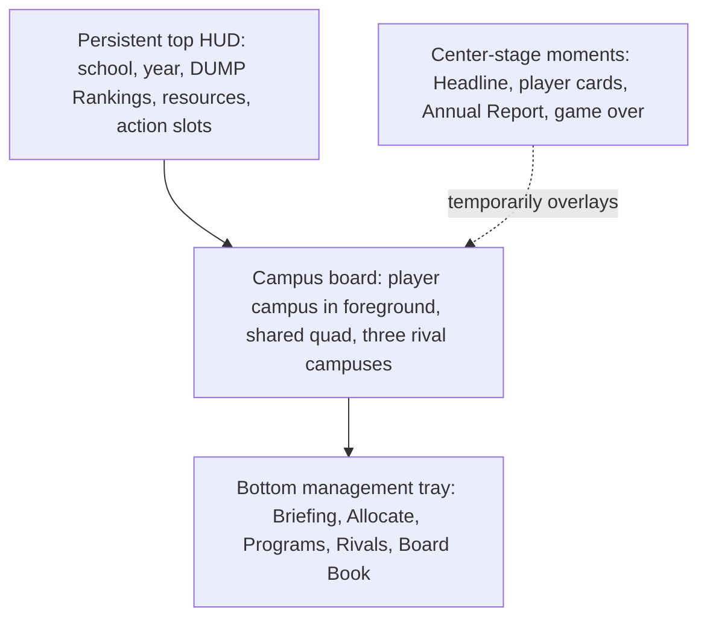
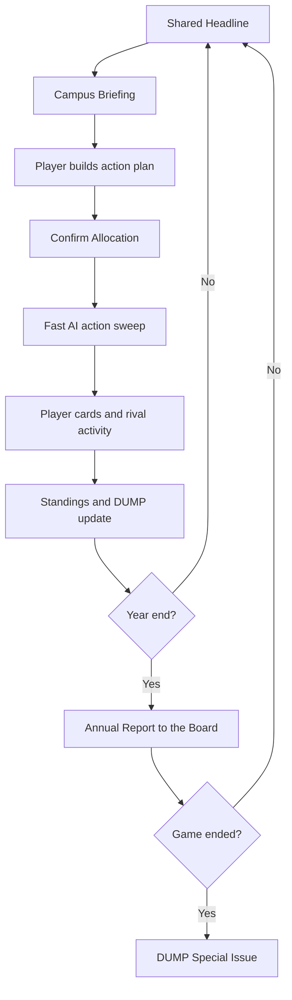
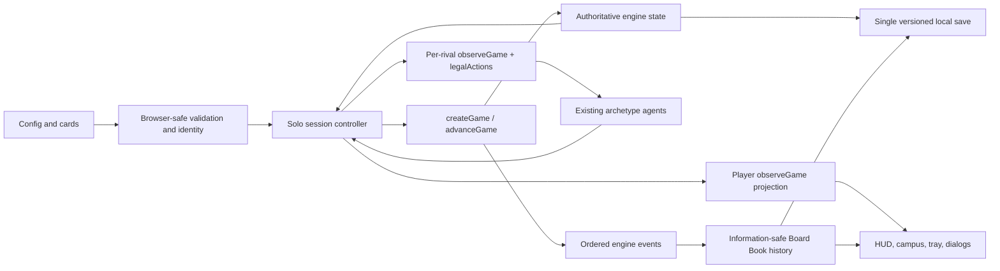
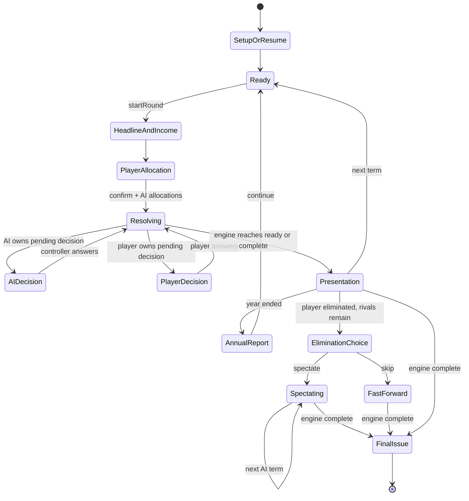
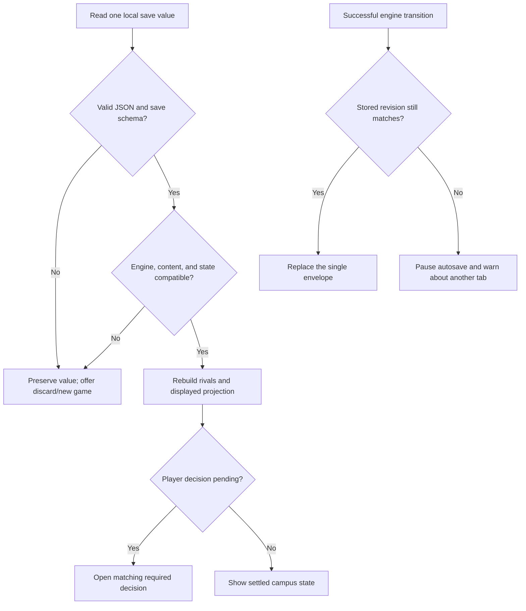

# Safety School Phase 2 Solo Campus Experience - Plan

> Completed on 2026-07-17. See `docs/phase-2-completion.md` for verification evidence, the shipped budget-visibility decision, and the Phase 3 handoff.

## Goal Capsule

- **Objective:** Deliver a polished, locally saved solo game against three AI rivals through a full-screen campus board that makes strategy, resource movement, rivalry, and escalating pressure easy to understand.
- **Authority:** `resolution-order.md` controls rule order, `balance-config.json` controls numbers, `cards.json` controls card content, the Phase 1 engine controls authoritative state, and this plan controls the Phase 2 player experience.
- **Execution profile:** Implement U1-U7 in dependency order. Stop after U3 for the user's board-and-building visual approval before integrating the complete play experience.
- **Stop conditions:** Stop for a rule or information-boundary conflict, a browser port that changes canonical state or content identity, or a visual direction that has not passed the U3 workshop. Do not change balance, cards, agent policy, or engine mechanics to accommodate the interface.
- **Completion signal:** A player can start, resume, play, spectate or skip after elimination, and finish a solo game in the browser; the Phase 1 verification remains green; and the approved campus presentation passes the full keyboard, reduced-motion, and no-page-scroll browser scenarios.

---

## Product Contract

### Summary

Phase 2 will turn the validated headless game into a locally autosaved solo experience against three named AI schools. A fixed, evolving 2.5D campus remains the primary surface while management drawers, staged cards, annual reports, and rival activity create the rhythm of a competitive board game.

Implementation will preserve the existing engine and use a dependency-free browser client. Its first player-facing milestone is a focused workshop of the board composition, playing area, buildings, five-level growth, quad activity, and campus atmosphere; cards, reports, mascots, and final decorative assets remain provisional until that direction is approved.

### Problem Frame

Phase 1 proved that the engine is deterministic and balanced, but the original Phase 2 outline describes a set of functional screens rather than the experience connecting them. A dashboard-led client would expose the numbers without delivering the attachment, pressure, rivalry, and satire that define the game.

The interface must make a complex 30-round strategy game readable without becoming a free-placement city builder or altering the validated rules. Players should understand how their decisions shaped each result, feel their campus grow or struggle, and recognize why the eventual winner prevailed.

### Actors

- A1. **Player:** Names and develops one university, makes every local decision, and receives all private information belonging to that university.
- A2. **AI rival:** One of five named schools mapped consistently to a Phase 1 strategy archetype, acting under the same rules and information boundaries as the player.

### Key Decisions

- **Solo-first Phase 2.** (session-settled: user-directed — chosen over shipping hotseat in Phase 2: polishing one solo experience avoids committing to multiplayer behavior while the backend model remains unresolved.)
- **Campus board as the primary surface.** (session-settled: user-approved — chosen over dashboard-first navigation: the player should feel ownership of a living university while management information remains close at hand.)
- **Fixed 2.5D campus.** (session-settled: user-approved — chosen over free placement or realtime 3D: fixed plots and lightweight animation deliver the intended SimCity and RollerCoaster Tycoon feeling at board-game scope.)
- **Presentation-only DUMP Rankings.** (session-settled: user-directed — chosen over rank-based Marketing bonuses: the parody can enrich rivalry without disturbing the validated balance.)
- **Emergent acts.** (session-settled: user-directed — chosen over announced chapter labels: the honeymoon, squeeze, and reckoning should be felt through state, pacing, and presentation.)
- **Selective spectacle.** (session-settled: user-approved — chosen over full-screen reveals for every AI card: player cards and major rival events receive staging while routine AI outcomes stay fast.)
- **One player-facing ruleset.** (session-settled: user-approved — chosen over program and difficulty selectors: Programs remain enabled and rival variety comes from strategy rather than hidden bonuses.)
- **Standard architecture for Phase 2.** (session-settled: user-directed — chosen over multiple building themes: one coherent asset set supports visual refinement without multiplying production work.)
- **Plan actions before applying them.** (session-settled: user-approved — chosen over immediate purchases from buildings: campus interactions should feed the Allocation plan before any round is confirmed.)
- **Purposeful motion.** Motion follows the `emil-design-eng` decision framework: every animation must clarify state, spatial continuity, explanation, or feedback, while repeated interactions remain immediate.
- **Board-first visual workshop.** (session-settled: user-directed — chosen over postponing asset direction until after Phase 2: board composition, buildings, atmosphere, and the general playing area are approved before production integration.)
- **Player-controlled post-elimination pacing.** (session-settled: user-directed — chosen over always ending or always fast-forwarding: an eliminated player may spectate the remaining AI game or skip to the final result.)

### Viewport Composition

The game occupies one desktop or laptop viewport. Temporary overlays may take visual priority, but they do not replace the persistent campus context or introduce page scrolling.



### Requirements

**Game setup and continuity**

- R1. Phase 2 supports one human player against exactly three AI rivals with no hotseat or network play.
- R2. Each new game randomly selects three of the five named rival schools, preserves each school's strategy personality, and reveals the lineup before the player assigns starting upgrades.
- R3. Setup lets the player name their school, choose a preset mascot and color set, and distribute the rules-defined three free department levels.
- R4. Programs are always enabled and all rivals use one standard difficulty without hidden bonuses or penalties.
- R5. The current game autosaves locally after material transitions and resumes from the latest valid state after a refresh or browser restart.

**Campus and visual state**

- R6. The primary game view fits within one desktop or laptop viewport without page scrolling; an expanded management tray may scroll internally.
- R7. The player's campus fills the foreground from a rear aerial perspective while the three rival campuses remain visible around a shared board-game space.
- R8. The campus has six fixed department plots surrounding a permanently open central quad used for student life and event activity.
- R9. Every department begins as a small Level 1 building and shows five readable upgrade levels through visible growth plus an explicit numeric level.
- R10. Phase 2 uses one coherent set of standard 2.5D building assets and lightweight ambient motion rather than free placement or a free camera.
- R11. Quad activity responds to game state: enrollment affects population, recruiting affects tours, cards cause relevant activity, and austerity visibly empties or stresses the campus.
- R12. State-driven visual activity remains presentation only and never creates resources, modifiers, or decisions outside the engine.

**Persistent information and management**

- R13. The top HUD always shows the player's school identity, current year and term, four-school DUMP ranking ribbon, treasury, students, reputation, alumni, and remaining action slots.
- R14. The bottom tray contains Briefing, Allocate, Programs, Rivals, and Board Book sections and can collapse to preserve the campus view.
- R15. Briefing summarizes the funnel, current cash flow, upkeep, strain, active effects, and urgent warnings without duplicating the complete annual report.
- R16. Selecting one of the player's buildings opens its current effect, next-level improvement, build cost, upkeep change, and eligible actions.
- R17. Building upgrades and other choices enter the standard two-slot Allocation plan; the player can replace actions and review projected treasury and upkeep before confirming. A clearly marked bonus slot appears only when the engine grants an extra action.
- R18. An unused Allocation slot resolves as Bank, and no staged action changes authoritative game state before confirmation.
- R19. Programs shows current programs, available slots, opening requirements, and eligible choices; Board Book retains past cards, annual reports, trends, and contextual help.
- R20. Selecting a rival campus opens its public department levels, programs, students, reputation, approximate treasury, recent events, and DUMP movement without changing the player's viewpoint.

**Round presentation and feedback**

- R21. Each round begins with the shared Headline taking center stage, then returns to the campus with net income and urgent warnings visible before Allocation.
- R22. After player confirmation, AI actions resolve in a brief simultaneous sweep using campus animation and the rival activity feed while preserving hidden treasury information.
- R23. The player's Fortune and Crisis cards receive center-stage reveals that show the base effect, target department, department scaling, Administration mitigation, and final result before the corresponding visual state change appears on the campus.
- R24. Routine AI cards resolve in the rival activity feed; severity-three cards, elimination, and austerity milestones are the only baseline rival outcomes that receive larger staging.
- R25. `DUMP Rankings™: Definitive Ultimate Marketing Ploy` derives only from public standings, updates when standings resolve, marks eliminated schools as closed and unranked, and grants no gameplay bonus or penalty.
- R26. Round transitions provide immediate visual feedback for state changes without hiding calculations or delaying the next decision.

**Pressure, year-end, and conclusion**

- R27. Forced austerity becomes an Emergency Board Meeting state that keeps the campus visible, locks the tray to the required sale, and previews cash recovered, upkeep saved, and reputation lost for each eligible building.
- R28. Every year ends with a mandatory Annual Report to the Board showing DUMP movement, enrollment and funnel results, financial and alumni changes, and the next disruption information the player is entitled to know.
- R29. The game's emotional acts emerge from existing conditions through campus activity, warnings, pacing, and reports rather than explicit chapter announcements.
- R30. Game over presents a DUMP Rankings Special Issue with the winner, information-safe final score explanations, decisive turning points, and a final campus view.

**Onboarding, accessibility, and design review**

- R31. The first game provides dismissible contextual guidance during setup, first Allocation, first card reveal, and first annual report; the guidance remains available in Board Book.
- R32. All essential controls support keyboard operation, visible focus, readable contrast, and labels that do not rely on color alone.
- R33. Reduced-motion behavior removes nonessential movement while preserving state-change feedback and all game information.
- R34. Before production styling is finalized, a reviewable visual prototype covers the board composition, foreground and rival playing areas, all six building plots, representative Level 1/3/5 growth, quad atmosphere, tray coexistence, and prosperity, strain, and austerity states.

**Motion quality**

- R35. Frequent management interactions and keyboard actions respond immediately; nonessential animation never delays input or blocks the next decision.
- R36. Drawers, popovers, cards, and campus state changes preserve spatial origin and reverse cleanly when interrupted rather than restarting or snapping.
- R37. Routine UI motion remains brief, normally under 300 milliseconds, while longer expressive motion is reserved for rare ceremonies such as annual reports and game over.
- R38. Motion remains smooth during normal game resolution and degrades to non-spatial feedback when reduced motion is requested.

**Post-elimination play**

- R39. If the player is eliminated before the engine has a winner, the interface offers Spectate and Skip to Results. Spectate advances the AI game term by term with public presentation, no player decisions, and an always-available Skip Remaining control; Skip resolves the same AI commands without intermediate staging. Both paths reach the same deterministic final state.

### Key Flows

- F1. New solo game
  - **Trigger:** The player starts a new game.
  - **Actors:** A1, A2
  - **Steps:** The game selects and reveals three rival schools; the player names their school, chooses a mascot and colors, distributes three free levels, and confirms setup.
  - **Outcome:** A locally autosaved game opens on the player's campus before the first Headline.
  - **Covered by:** R1-R5
- F2. Standard term
  - **Trigger:** A new term begins.
  - **Actors:** A1, A2
  - **Steps:** The Headline appears; income and warnings settle into Briefing; the player stages and confirms available actions; AI actions sweep across rival campuses; player cards receive full reveals; AI cards update through the feed; standings and DUMP Rankings update.
  - **Outcome:** The player understands what changed, why it changed, and what pressure carries into the next term.
  - **Covered by:** R13-R26
- F3. Annual close
  - **Trigger:** The fifth term of an academic year finishes normal resolution.
  - **Actors:** A1, A2
  - **Steps:** Year-end rules resolve; the Annual Report presents funnel, financial, alumni, ranking, and disruption information; the player returns to the changed campus.
  - **Outcome:** The year's strategy and consequences are legible before the next year begins.
  - **Covered by:** R28-R29
- F4. Emergency austerity
  - **Trigger:** The engine requires the player to sell department levels to restore solvency.
  - **Actors:** A1
  - **Steps:** The Emergency Board Meeting state identifies eligible buildings; the player reviews each consequence and confirms one required sale at a time until the engine can continue.
  - **Outcome:** The player experiences the crisis as dramatic but retains clear information and agency.
  - **Covered by:** R27
- F5. Game conclusion
  - **Trigger:** One university remains or the Year 6 scoring sequence completes.
  - **Actors:** A1, A2
  - **Steps:** Final scoring resolves; the DUMP Special Issue declares the winner, explains the result without revealing protected rival information, highlights turning points, and ends on the final campus view.
  - **Outcome:** The winner feels attributable to visible strategic and game-state causes.
  - **Covered by:** R30
- F6. Player eliminated before the rivals finish
  - **Trigger:** The player's school is eliminated while at least two AI schools remain.
  - **Actors:** A1, A2
  - **Steps:** The player chooses Spectate or Skip to Results. Spectate retains public round presentation with player management disabled; Skip suppresses intermediate staging while the same AI policies resolve the remainder.
  - **Outcome:** The player controls pacing without changing the engine result or losing the final winner explanation.
  - **Covered by:** R39

### Round Flow



### Acceptance Examples

- AE1. **Covers R2-R4.** Given a new game, when setup opens, then three distinct named rivals are visible before the player confirms a legal three-level starting distribution with Programs enabled.
- AE2. **Covers R16-R18.** Given a selected building, when the player adds an upgrade and replaces it before confirmation, then the preview changes but authoritative treasury and building level do not change until the final plan is confirmed.
- AE3. **Covers R21-R24.** Given a normal term, when Chance resolves, then the player's cards show their complete effect calculation while routine AI cards finish through the feed without requiring individual dismissal.
- AE4. **Covers R20, R22.** Given a rival campus selection, when its profile opens, then public development and recent actions are visible while exact treasury and private foresight remain hidden.
- AE5. **Covers R25, R28.** Given a year-end standings change, when the Annual Report opens, then DUMP movement matches the public ranking formula and causes no additional resource or modifier change.
- AE6. **Covers R27.** Given a forced-sale decision, when the Emergency Board Meeting opens, then only eligible buildings can be selected and every choice previews recovery, upkeep, and reputation consequences before confirmation.
- AE7. **Covers R5.** Given an in-progress game after a completed material transition, when the browser restarts, then the game resumes from that transition without duplicating events or RNG use.
- AE8. **Covers R31-R33.** Given reduced motion and keyboard navigation, when the player completes setup and one term, then all decisions, calculations, and feedback remain available without pointer input or essential animation.
- AE9. **Covers R30.** Given a final result, when game over appears, then the declared winner matches the engine and the recap identifies visible turning points without revealing exact rival treasury or private foresight.
- AE10. **Covers R35-R38.** Given rapid tray changes or an interrupted drawer transition, when the player immediately chooses another destination, then the interface responds without waiting, restarts, lost input, or hidden state.
- AE11. **Covers R39.** Given the player is eliminated before the winner is known, when identical saved states choose Spectate and Skip to Results, then both finish with byte-identical engine state, winner, RNG cursor, and Board Book outcomes.

### Success Criteria

- A complete solo game runs from setup to elimination or Year 6 without rule, resource, replay, or save divergence from the Phase 1 engine.
- A full playtest targets the documented 60-90 minute session while AI actions and transitions remain a minor portion of elapsed time.
- Players can build, reallocate, open Programs, campaign, poach, bank, and handle required decisions without leaving the campus context or consulting an external rulebook after onboarding.
- Players can explain how major strategic choices affected their resources and why the winning university prevailed.
- The experience naturally shifts from campus attachment to management pressure to competitive endgame without explicit act labels.
- Campus state changes, cards, annual reports, and DUMP movement are entertaining and transition smoothly without obscuring the underlying math.
- Repeated controls feel immediate, rare ceremonial motion adds delight without dragging, and the reduced-motion experience preserves every explanation and decision.
- The primary desktop or laptop flow never requires page scrolling.
- The approved board and building direction remains recognizable through normal, prosperous, strained, austerity, and final-campus states.

### Scope Boundaries

**Deferred to Phase 3**

- Multiplayer shape, backend provider, accounts, lobbies, invitations, synchronization, and reconnect behavior.
- An owner-level dashboard for aggregate game and player activity, health, and usage statistics.
- An owner-only card editor that can add or revise content through approved modifiers while preserving the deck identity used by existing games.
- Every published deck change receives automated balance regression testing; new modifier types or larger mechanic changes require the full rebalancing process.

**Deferred beyond the Phase 2 baseline**

- DUMP methodology drift in which annual criteria change and stronger Administration reveals the next rubric early.
- Architecture packs, additional building themes, production audio, timed play, spectator tools for external viewers, and mobile-first layouts.
- Multiple local save slots, save import/export, cloud saves, and cross-device continuity.
- Concurrent play from multiple browser tabs; Phase 2 warns and pauses known-stale writes but supports one active tab.
- Difficulty modes or AI bonuses unless playtesting demonstrates a specific need.

**Outside this product shape**

- Free-placement construction, terrain editing, and a fully simulated city population.
- Realtime 3D navigation or a free camera that replaces the board-game viewpoint.

### Product Contract Preservation

The original Phase 2 requirements remain intact. Planning clarified four implementation-facing behaviors without changing mechanics: public-only DUMP scoring, bonus action slots when the engine grants them, the threshold for staged rival events, and the player's Spectate-or-Skip choice after elimination. The confirmed visual workshop now focuses first on the board, buildings, atmosphere, and playing area; it does not remove later card, report, austerity, or game-over polish.

### Dependencies and Assumptions

- The completed Phase 1 engine, agents, state, and event stream remain the authority for all mechanics and AI decisions.
- `reports/phase-1-balance.md` records passing results for both Program branches, 20,016 scored games, and byte-identical replay samples; Phase 2 does not require a balance change.
- Public and private information follow the existing game contract: exact rival treasury and unrevealed Administration foresight never appear in the rendered player view, including the final issue.
- The visual prototype may use CSS geometry and placeholder details while the campus layout, building language, atmosphere, and state communication are refined.
- Final rival school names, mascots, palettes, typography, and production art direction can be chosen during later visual refinement without changing the Product Contract.
- Implementation and motion review load `emil-design-eng`; animation review applies its frequency, purpose, easing, duration, interruption, performance, and reduced-motion guidance.

### Outstanding Questions

**Deferred to the visual workshop**

- Choose the exact foreground-to-rival scale, campus silhouettes, building growth language, quad density, and prosperity/strain/austerity cues.
- Choose the final five rival school identities and the player's preset mascot and color options after the board direction is stable.

**Deferred to later Phase 2 polish**

- Final card, Annual Report, DUMP Special Issue, typography, icon, and decorative asset styling.

### Sources

- `SAFETY-SCHOOL-GOING-CONCERN-DESIGN.md` — product intent, emotional pillars, departments, round structure, public information, and game length.
- `resolution-order.md` — authoritative round, year-end, pending-decision, and information timing.
- `balance-config.json` — authoritative numeric rules and enabled Program catalog.
- `cards.json` — validated card content and effect vocabulary.
- `BUILD-PLAN.md` — original Phase 2 boundary and Phase 3 sequencing; this plan supersedes its Phase 2 hotseat and dashboard-first assumptions.
- `docs/plans/2026-07-15-001-feat-phase-1-engine-balance-plan.md` — deterministic engine and replay contract inherited by the client.
- `reports/phase-1-balance.md` — passing balance and determinism evidence used as the no-mechanics-change baseline.
- `emil-design-eng` skill — user-selected motion decision and interface-polish standard for Phase 2 planning and review.

---

## Planning Contract

### Key Technical Decisions

- **KTD1. Preserve the engine boundary:** The browser owns orchestration, persistence, and presentation only. Every game mutation still enters through `createGame` or `advanceGame`; every player-facing action comes from `legalActions`; and every rendered rival view is built from `observeGame`, not raw opponent state.
- **KTD2. Use the existing platform:** Build the client with browser ES modules, semantic HTML, CSS, and DOM APIs, served by a small Node standard-library server. Add no framework, bundler, component library, animation library, or test dependency; the current repository and platform cover this phase.
- **KTD3. Make shared content browser-safe without weakening identity:** Keep canonicalization and validation in the shared content module, move filesystem and Node-crypto concerns into a Node-only loader, and supply a synchronous SHA-256 implementation appropriate to each runtime. Browser and Node digest providers must produce identical bytes and preserve existing config, card, and round-snapshot identities.
- **KTD4. Mirror the proven simulation loop:** A solo session controller follows the existing `sim/run.js` lifecycle: start a ready round, collect the player's confirmed allocation, ask each active AI for its allocation using its own observation, submit one simultaneous allocation command, automatically answer AI-owned pending decisions, and pause only for a player-owned decision.
- **KTD5. Separate authoritative, displayed, and historical state:** The controller holds authoritative engine state; the renderer receives an information-safe displayed projection; and Board Book stores a compact normalized history. During a required reveal, authoritative state may already be saved while the displayed projection temporarily shows the prior state plus the calculation, then advances once the reveal completes.
- **KTD6. Save one atomic session envelope:** Use one versioned `localStorage` value containing engine state, human and rival identities, tutorial progress, compact history, and a monotonic save revision. Save after every successful engine transition, never persist transient animation queues, reject incompatible content before resume, and preserve corrupt data until the player explicitly discards it. Phase 2 supports one active tab; a `storage` event or observed revision change pauses later writes and warns the user, but does not claim transactional multi-tab synchronization.
- **KTD7. Reconstruct scripted rivals, not policy closures:** The three Phase 2 rivals map to the five non-Random archetypes. Their policy choices are deterministic from observation, so a resumed game reconstructs them from saved school/archetype metadata without serializing closures or adding a second policy-state format.
- **KTD8. Keep cosmetic randomness separate:** Rival selection, game seed generation, and ambient visual variation use browser randomness before or outside engine transitions. Cosmetic choices never consume the game's seeded RNG, and all setup choices needed for replay are saved.
- **KTD9. Define DUMP from public score factors only:** At each `standingsPublished` event, compute `students × 0.01 + reputation + department levels × 5 + programs × 5 + alumni × 0.002` for active schools. Omit treasury, give exact ties the same competition rank, show preseason schools as unranked, mark eliminated schools closed and unranked, and never feed DUMP output back into engine commands or AI policy. This mirrors the public portion of Institutional Health Score while preserving treasury secrecy. (session-settled: user-approved — chosen over including treasury or adding Marketing effects.)
- **KTD10. Use a small deterministic spectacle threshold:** Full-stage rival interruptions are limited to severity-three cards, elimination, and forced-austerity milestones. Everything else appears in the nonblocking activity feed, preventing a four-school term from becoming a sequence of dismissals. (session-settled: user-approved — chosen over staging every rival card.)
- **KTD11. Make post-elimination paths presentation variants:** Spectate advances one AI term at a time with public board, feed, ranking, and annual presentation; Skip runs the identical controller and policies with transient staging suppressed. Neither path introduces a second simulation implementation. (session-settled: user-directed — chosen over a mandatory ending or mandatory fast-forward.)
- **KTD12. Prototype the board before production integration:** U3 uses representative fixture states to workshop board framing, foreground/rival scale, six building plots, Level 1/3/5 growth, quad density, tray overlap, and prosperity/strain/austerity atmosphere. Gameplay integration waits for explicit user approval of this direction. (session-settled: user-directed — chosen over designing assets after implementation.)
- **KTD13. Represent the campus with accessible DOM and CSS:** Buildings remain semantic buttons with explicit names and levels; lightweight CSS geometry and state classes provide the 2.5D effect. Cap ambient figures to a small visual sample derived from enrollment bands rather than creating one node per student or adopting canvas/3D rendering.
- **KTD14. Treat motion as feedback, not a timeline:** Frequent tabs, allocation edits, keyboard actions, and hover feedback are immediate or near-immediate. Drawers, popovers, and board changes use interruptible CSS transitions over transform and opacity; rare annual and final ceremonies may run longer. Hover styling is pointer-capability gated, and reduced motion replaces spatial movement with opacity, color, and text updates.
- **KTD15. Use native modal semantics for required ceremonies:** Headline, player-card, Annual Report, Emergency Board Meeting, and final-issue staging use `<dialog>` with explicit focus entry, close/continue behavior, Escape rules appropriate to whether a decision is mandatory, focus restoration, and a readable nonanimated state.
- **KTD16. Keep the final explanation information-safe:** The final issue uses public factors, treasury bands, public DUMP history, visible turning points, and the engine-declared winner. It never exposes exact rival treasury, secret disruption foresight, or a reconstructable exact rival Health Score.

### High-Level Technical Design

The sketches below describe boundaries and lifecycle, not exact function signatures or DOM structure.

#### Component and information topology



#### Solo controller lifecycle



#### Transition, presentation, and persistence order

```mermaid
sequenceDiagram
  participant UI as Player UI
  participant C as Controller
  participant E as Engine
  participant S as Local save
  participant P as Presentation
  UI->>C: Confirm legal command
  C->>E: advanceGame
  E-->>C: next state + ordered events + pending decision
  C->>C: normalize information-safe history
  C->>S: atomically save state + history + revision
  C->>P: queue required reveals from before/after projections
  P-->>UI: show calculation, then settle visual state
  Note over S,P: Refresh resumes settled state; transient reveals are not replayed
```

#### Save and recovery lifecycle



### Initialization and Sequencing Decisions

- The local server exposes only the web client, shared engine and agent modules, and the two root content JSON files. It handles `GET` and `HEAD`, emits correct module and asset MIME types, and rejects traversal or unrelated repository paths.
- The play server binds to `127.0.0.1` on one documented default port and prints that canonical URL. It fails clearly rather than silently choosing a different port because `localStorage` is origin-scoped and a port change would appear to lose the current save.
- Browser startup fetches config and cards, validates them, and computes the same content identity as the Node loader before showing Resume or New Game.
- New Game uses browser cryptographic randomness for a game seed and a distinct three-of-five rival selection, then stores the chosen identities and archetypes as setup metadata. It never asks the engine RNG to choose presentation content.
- Rival schools use the five scripted archetypes only; the intentionally weak Random fuzz agent remains a Phase 1 test policy, not a Phase 2 opponent.
- The player sees the rival lineup before distributing the required three starting upgrades. Setup cannot create engine state until the name, preset identity, and upgrade allocation all pass validation.
- Before the first `standingsPublished` event, the DUMP ribbon shows all schools as preseason/unranked. Later ranks derive only from the most recent public standings event.
- A staged allocation is ordinary UI state. Confirmation builds one engine allocation command containing the player's actions and all active AI actions; cancelling or replacing a slot never calls the engine.
- A standard round exposes two action slots. The renderer uses `legalActions.maxActions`, so a rules-granted bonus produces an additional labeled slot without hardcoding a second allocation path.
- After every engine return, the controller first ingests events into compact history and writes the new save envelope. Required card or report presentation then moves the displayed projection forward; refresh never repeats the command or its transient animation.
- AI-owned Admin and forced-sale decisions resolve automatically with that rival's existing policy. Player-owned decisions reopen the corresponding required dialog after resume.
- Annual reports derive from that year's ordered engine events and saved public/player snapshots. Board Book does not retain raw `roundSnapshot.bytes` or private rival data.
- If the player chooses Spectate, the same controller advances one term per continue action, disables management controls, saves spectator mode, and keeps Skip Remaining available. If the player chooses Skip, it suppresses transient presentation and loops until `state.finished`, retaining the final compact history.
- Starting a new game while a valid save exists requires explicit replacement confirmation. A corrupt or incompatible save is never silently overwritten.

### Output Structure

```text
engine/
  content.js             browser-safe validation, canonicalization, and default digest
  content-node.js        Node filesystem loader and native digest provider
  index.js               existing engine entry point
  rng.js                 existing seeded and derived RNG helpers
  rules.js               existing rules; runtime digest use only
web/
  index.html             semantic full-viewport shell and dialogs
  styles.css             board, buildings, tray, responsive states, and motion
  app.js                 DOM rendering, input routing, and startup
  game.js                solo controller, setup metadata, AI loop, and view model
  presentation.js        event explanations, DUMP, reports, feed, and Board Book
  storage.js             one-slot save validation, revision, and recovery
  server.js              local standard-library static server
test/
  content-contract.test.js
  web-game.test.js
  web-presentation.test.js
  web-server.test.js
  web-storage.test.js
package.json
```

Existing engine, agent, simulator, product, balance, and report files remain in place. Do not introduce an asset pipeline or component directory until the approved visual direction produces assets that genuinely require one.

### System-Wide Impact

- **Engine imports:** `engine/content.js` becomes browser-safe; Node-only callers and tests that need `loadContent` switch to `engine/content-node.js`. Public game commands, state schema, event types, agent API, config, and cards remain unchanged.
- **Digest behavior:** Content identities, replay checkpoints, and round snapshots must remain byte-identical across the old Node implementation, the new Node provider, and the browser provider. A digest mismatch is a release blocker, not a migration.
- **Simulation performance:** Full Monte Carlo runs continue using Node's built-in crypto provider so browser portability does not turn snapshot hashing into a Phase 1 performance regression.
- **Information boundaries:** The local controller necessarily holds full solo state to drive all players, but rendering and history consume player observations and filtered events. Phase 2 local saves are not a future multiplayer wire format and must never be uploaded as trusted server state.
- **Persistence lifecycle:** Save schema versioning is separate from engine state schema versioning. Invalid JSON, incompatible content, storage denial/quota errors, and stale cross-tab revisions fail into explicit recovery states while the in-memory game remains playable where possible.
- **Origin stability:** Local persistence belongs to the exact HTTP origin. The documented loopback URL is part of the local run contract; changing scheme, host spelling, or port creates a different browser save namespace rather than migrating data.
- **Presentation lifecycle:** Engine state commits once per command; visual staging never reapplies effects. Board Book and Annual Report are projections of recorded transitions, so changing their layout cannot change replay state.
- **Accessibility:** Required dialogs, collapsed/expanded tray states, and building controls preserve focus and accessible names through rerenders. Visual growth and state changes always have numeric or textual equivalents.
- **Phase 3 boundary:** No account, API, database, server authority, telemetry, owner dashboard, or editable card store is introduced. The web shell must be replaceable around the unchanged engine when Phase 3 architecture is chosen.

### Risks and Mitigations

| Risk | Consequence | Mitigation |
|---|---|---|
| Browser portability changes content or snapshot hashes | Existing saves, reports, and deterministic replay no longer agree | Keep SHA-256 and canonical serialization unchanged, compare Node/browser providers against known vectors and current content identities, and run the full Phase 1 gate. |
| A pure browser hash slows Node simulation | The balance harness becomes expensive to rerun | Keep Node's built-in crypto provider in the Node loader and measure the existing full verification rather than forcing one implementation into both runtimes. |
| UI reads raw rival state | Exact treasury or secret foresight leaks through panels, history, or the final issue | Build render models from `observeGame`, filter engine events before history storage, and add explicit no-leak scenarios for normal, revealed, and final states. |
| Visual staging and saved state diverge | Refresh repeats effects or resumes behind the last visible card | Save authoritative state and normalized history before staging; never persist transient queues; resume directly to the settled state or active player decision. |
| Corrupt, incompatible, or known-stale saves are overwritten | The player's only local game is lost | Validate before replace, retain invalid raw data until discard, warn persistently on storage failure, and pause writes when a storage event or revision check reveals another tab. Concurrent racing tabs remain unsupported. |
| The local server starts on a different origin | A valid save appears to disappear | Bind and print one canonical loopback URL, fail on a port conflict, and document that alternate origins have separate browser storage. |
| Four schools create too many interruptions | A term feels slower than the decisions | Stage all player cards but only the confirmed rival threshold; keep routine AI results in one feed and make Skip use the same event ledger without animation. |
| A dense 2.5D board overflows smaller laptops | The tray or HUD hides essential controls or introduces page scroll | Approve representative viewport captures in U3, use internal tray scrolling, cap figures, and verify the complete flow at the target viewport matrix. |
| Asset polish begins before composition works | Time is spent redrawing buildings and cards around a weak board | Use CSS/placeholder geometry for U3 and require explicit board/building approval before final assets or complete gameplay integration. |
| Ambient animation consumes resources or obscures changes | The board becomes noisy, janky, or inaccessible | Cap ambient entities, animate transform/opacity only, pause decorative loops when hidden, test under load, and provide reduced-motion and textual equivalents. |
| Final scoring explanation reveals exact rival cash indirectly | Information rules are broken at the moment they matter most | Show public components and treasury bands, avoid reconstructable exact totals, and treat the engine winner as authoritative even when DUMP order differs. |

### Resolved During Planning

- DUMP uses the public portion of the existing Health Score weights and excludes treasury.
- Rival staging is limited to severity-three cards, elimination, and austerity milestones.
- Phase 2 uses one active local save rather than a save library.
- A player eliminated before game completion chooses Spectate or Skip to Results.
- The visual workshop happens before gameplay integration and focuses on the board, buildings, atmosphere, and playing area.
- Shared browser modules require a local HTTP server; direct `file://` execution is not supported.

### Sources and Research

**Repository evidence**

- `engine/index.js` exposes the stable `createGame`, `advanceGame`, `observeGame`, `legalActions`, state-schema, engine-version, and content-compatibility boundaries used by this plan.
- `engine/rules.js` establishes the ready/allocation/pending/complete lifecycle, ordered event stream, public standings, player observations, and legal action previews.
- `sim/run.js` supplies the proven orchestration loop reused by the browser controller.
- `agents/index.js` supplies the five scripted archetypes and their information-safe setup, allocation, and pending-decision policies.
- `engine/content.js` currently mixes portable validation/canonicalization with Node-only filesystem and crypto imports; U1 isolates that actual browser blocker rather than adding a bundler or duplicate engine.
- `test/engine-setup.test.js`, `test/replay.test.js`, and the passing Phase 1 report establish the identity and determinism baseline that browser work must preserve.

**Platform guidance**

- [MDN: JavaScript modules](https://developer.mozilla.org/en-US/docs/Web/JavaScript/Guide/Modules) documents the HTTP/MIME requirement and `file://` limitations that justify the local server.
- [MDN: Window.localStorage](https://developer.mozilla.org/en-US/docs/Web/API/Window/localStorage) documents origin-scoped persistence, synchronous access, and possible security exceptions that shape the compact one-envelope save and error handling.
- [MDN: `<dialog>`](https://developer.mozilla.org/en-US/docs/Web/HTML/Reference/Elements/dialog) and [showModal](https://developer.mozilla.org/en-US/docs/Web/API/HTMLDialogElement/showModal) support native modal, backdrop, inert-background, focus, and Escape semantics for required ceremonies.
- [MDN: prefers-reduced-motion](https://developer.mozilla.org/en-US/docs/Web/CSS/Reference/At-rules/%40media/prefers-reduced-motion) and [WCAG 2.2 Understanding Animation from Interactions](https://www.w3.org/WAI/WCAG22/Understanding/animation-from-interactions) ground the non-spatial reduced-motion fallback.
- `emil-design-eng` supplies the user-selected frequency, purpose, easing, duration, interruption, spatial-origin, performance, and reduced-motion standards applied in U3 and U7.

---

## Implementation Units

### U1. Establish the browser-safe deterministic content boundary

- **Goal:** Let browsers import the engine and agents without changing any content identity, snapshot digest, command, event, or simulation behavior.
- **Requirements:** R1, R4-R5, R12, R25; AE7; KTD1-KTD3.
- **Dependencies:** None.
- **Files:** `engine/content.js`, `engine/content-node.js`, `engine/rules.js`, `sim/replay.js`, `sim/run.js`, `sim/worker.js`, `package.json`, `test/agents.test.js`, `test/chance-effects.test.js`, `test/content-contract.test.js`, `test/engine-setup.test.js`, `test/replay.test.js`, `test/round-resolution.test.js`, `test/simulation.test.js`, `test/year-end.test.js`.
- **Approach:** Remove Node-only imports and CLI behavior from the shared content module while preserving its validation, canonicalization, freezing, and digest contract. Put filesystem loading and native crypto in the Node-only module. Let validated content carry the synchronous digest provider used for content identities and round snapshots so Node keeps native performance and browsers use the small in-repo SHA-256 implementation. Update Node entry points to use the Node loader; do not alter state or content versions because canonical output remains unchanged.
- **Patterns to follow:** Existing content validation and `assertCompatibleContent`; existing canonical-string and replay identity checks.
- **Test scenarios:**
  1. Known empty-string, short-string, and multi-block SHA-256 vectors match in the browser-safe and Node providers.
  2. Both providers validate the checked-in config and cards to the existing identities: config `45df9be6af3b477f98724c3659a7511de9c390e64db7b8d516f83474714fadc0` and cards `d81fca95f5b8c7ac9bc32281cb922f4f4fd3111aae523fdf884830e68c8fda53`.
  3. A seeded setup and complete replay retain their prior canonical state, event, RNG, and round-snapshot bytes after the split.
  4. Importing the shared content, engine, rules, RNG, and agent modules through a browser-style module graph encounters no `node:` import or filesystem access.
  5. Invalid content still fails with the same path-aware validation before game creation.
  6. A mismatched schema, engine version, config digest, or card digest is rejected before an engine transition.
- **Verification:** The normal test and content-validation gates pass, a browser module smoke import succeeds through HTTP, and the full Phase 1 verification remains byte-identical and within its existing practical runtime.

### U2. Add the local web entry point and full-viewport shell

- **Goal:** Serve a semantic, dependency-free browser shell that can host the visual workshop and later gameplay without exposing unrelated repository files.
- **Requirements:** R6, R13-R14, R32-R33; KTD2, KTD15.
- **Dependencies:** U1.
- **Files:** `web/server.js`, `web/index.html`, `web/app.js`, `web/styles.css`, `package.json`, `test/web-server.test.js`.
- **Approach:** Add a Node HTTP server with explicit route allowlisting for the web client, engine/agent modules, and canonical JSON content. Build the persistent HUD, board region, collapsible tray, activity region, dialog hosts, and startup/error states with semantic HTML. Use CSS custom properties for shared spacing, color, motion, and viewport sizing, but keep board art deliberately provisional for U3.
- **Patterns to follow:** Node standard-library scripts already used by the repository; native `<button>`, `<nav>`, `<output>`, `<dialog>`, and live-region semantics before custom behavior.
- **Test scenarios:**
  1. `/` serves the game shell; allowed modules, styles, and JSON receive correct MIME types; `HEAD` returns headers without a body.
  2. Encoded or plain traversal, unsupported methods, unrelated repository paths, and missing files are rejected without filesystem disclosure.
  3. The served shell imports the browser-safe content, engine, and agent graph without a console or MIME error.
  4. Startup content-fetch or validation failure produces a readable retry/error state instead of a blank screen.
  5. The base shell at target laptop viewports has no document scrollbar; an expanded tray scrolls internally when its content exceeds its panel.
  6. The server binds only to the documented `127.0.0.1` origin, reports a port conflict clearly, and never falls through to a different save namespace.
- **Verification:** The local play command serves a clean shell from a fresh checkout, server tests pass, and browser inspection shows a stable HUD/board/tray composition with no dependency or build step.

### U3. Workshop and approve the campus board, buildings, and atmosphere

- **Goal:** Establish the spatial and visual foundation the user wants before gameplay screens and production assets make it expensive to change.
- **Requirements:** R6-R12, R14, R20, R29, R34-R38; KTD12-KTD14.
- **Dependencies:** U2.
- **Files:** `web/index.html`, `web/app.js`, `web/styles.css`.
- **Approach:** Render representative fixture states for setup, a normal early campus, prosperous growth, strain, austerity, collapsed/expanded tray, and rival selection. Concentrate the workshop on the player's rear-aerial foreground perspective, the three rival positions, board edge and shared-space framing, six department plots, open quad, building footprints and Level 1/3/5 growth language, activity density, and atmosphere. Use HTML/CSS geometry and replaceable placeholders; keep card/report/mascot styling neutral. Iterate with the user on actual viewport captures, then record the approved direction in the implemented CSS and markup before proceeding.
- **Execution checkpoint:** This unit is not complete until the user explicitly approves the board composition, building growth direction, atmosphere, and playing-area relationship. Do not start final asset production or U4-U6 visual integration before that approval.
- **Motion review:** Apply `emil-design-eng` while introducing motion: frequent board selection is immediate, drawers preserve origin and interruption, ambient loops are sparse, and reduced motion retains all state cues. Later run `review-animations` against the implemented transitions rather than adding an animation library.
- **Test scenarios:**
  1. At 1024×768, 1280×720, and 1440×900, the player campus, three rival locations, HUD, and tray controls remain visible without document scrolling.
  2. All six department plots and the central quad are identifiable at a glance; each building is a keyboard-focusable named control rather than an unlabeled decorative hit area.
  3. Representative Level 1, 3, and 5 buildings show unmistakable silhouette growth plus a numeric level without moving to free placement or a free camera.
  4. Early, prosperous, strained, and austerity fixtures visibly differ through population, activity, maintenance/event cues, and text without changing layout or relying only on color.
  5. Opening and replacing tray sections preserves the campus context, uses internal overflow, and immediately accepts a new selection during an in-progress transition.
  6. Reduced motion removes ambient travel and spatial transitions while preserving selection, changed-state, and urgent-warning feedback.
- **Verification:** A reviewed capture set covers every fixture and viewport; the user approves the board/building/atmosphere direction; and no production card, report, or architecture-pack work was needed to reach the decision.

### U4. Build the solo session controller and resilient local continuity

- **Goal:** Drive one human and three scripted rivals through the existing engine with correct information boundaries, pending decisions, save/resume, and post-elimination pacing.
- **Requirements:** R1-R5, R17-R18, R22, R27, R39; F1, F2, F4, F6; AE1, AE2, AE6, AE7, AE11; KTD1, KTD4-KTD8, KTD11.
- **Dependencies:** U3.
- **Files:** `web/game.js`, `web/storage.js`, `web/app.js`, `test/web-game.test.js`, `test/web-storage.test.js`.
- **Approach:** Create a DOM-independent session controller around the public engine and agent APIs. Store the player identity, five rival definitions, chosen three-school lineup, archetype mapping, staged allocation, and engine state. On confirmation, gather legal AI choices from each rival's observation and submit one allocation batch. Continue through AI-owned pending decisions, pause for the player's decision, normalize returned events once, and save one atomic envelope. Rebuild agents and the displayed view on resume. Implement Spectate and Skip as pacing flags around this same loop.
- **Patterns to follow:** The phase loop and 300-command safety guard in `sim/run.js`; `deriveSeed` for independent policy seeds; `assertCompatibleContent`, `observeGame`, and `legalActions` for trust boundaries.
- **Test scenarios:**
  1. Covers AE1. Setup selects three distinct scripted rivals, preserves each school/archetype pairing, enables Programs, and refuses to create a game until the player's three free levels are legal.
  2. A ready state starts one round; an allocation state combines the confirmed player actions and every active AI allocation into one command; eliminated AIs receive no observation or action request.
  3. Covers AE2. Staging, replacing, or clearing an action changes only the preview. Confirmation submits the final plan once, and an empty slot becomes Bank through the existing engine normalization.
  4. AI-owned Admin and forced-sale decisions resolve automatically with information-safe observations; player-owned decisions pause and expose only legal commands.
  5. A save after each successful transition restores the exact engine bytes, lineup, tutorial position, and compact history without consuming RNG or repeating events.
  6. Invalid JSON, a wrong save schema, incompatible engine/content identity, quota/security failure, and a stale revision each produce the documented recovery or warning state without silently replacing the stored value.
  7. Refresh during a transient reveal resumes at the settled authoritative state; refresh during a player-owned pending decision reopens that decision.
  8. Covers AE11. Spectate and Skip from cloned eliminated-player states produce byte-identical final engine state, winner, RNG cursor, and normalized history; only their emitted presentation steps differ.
  9. Starting New Game over a valid save requires explicit confirmation; cancelling preserves the current envelope unchanged.
  10. Refresh while awaiting the post-elimination choice reopens that choice; refresh while spectating restores spectator mode, and Skip Remaining still reaches the same deterministic result.
- **Verification:** DOM-independent tests complete seeded sessions through normal rounds, both pending-decision types, save recovery, player elimination, spectating, skipping, and final victory without an illegal command, repeated transition, or information-boundary violation.

### U5. Connect setup, campus management, allocation, and rivals

- **Goal:** Turn the approved board and session controller into the complete decision-making surface for a normal solo term.
- **Requirements:** R2-R20, R31-R32; F1, F2; AE1, AE2, AE4, AE8; KTD1, KTD5, KTD12-KTD15.
- **Dependencies:** U4.
- **Files:** `web/index.html`, `web/app.js`, `web/game.js`, `web/styles.css`.
- **Approach:** Implement setup, Resume/New Game, HUD, building inspection, Briefing, Allocate, Programs, Rivals, and Board Book navigation. Render only controller view models; use event delegation so rerenders do not multiply listeners. Derive action cards, costs, recovery, upkeep savings, availability, and slot count from `legalActions`. Show projected voluntary spend and upkeep impact without pretending to predict stochastic recruiting or cards. Selecting a rival changes the profile/tray state, not the camera.
- **Patterns to follow:** Existing legal-action records already provide action, cost, recovery, and upkeep savings; existing observations supply exact own data and public rival data.
- **Test scenarios:**
  1. Setup supports name entry, a preset visual identity, three-level distribution with the per-department cap, visible rival lineup, keyboard completion, and a valid created game.
  2. HUD resources, year/term, DUMP status, and action slots match the displayed observation after each settled transition.
  3. Each building shows current level, next level, cost, upkeep change, and only its eligible legal actions; Level 5 and unavailable Admissions upgrades explain why they cannot be chosen.
  4. The allocation tray supports standard and bonus slots, replacement, clearing, Bank-by-omission, total voluntary spend, post-confirm treasury, and next-term base-upkeep change without implying that sale proceeds can fund same-round spend or that stochastic recruiting is predictable.
  5. Programs shows held programs, capacity, open slots, costs, and only legal openings; an Academics upgrade staged in the same round does not prematurely grant a slot.
  6. Covers AE4. Every rival profile shows public levels, programs, students, reputation, treasury band, recent public events, and DUMP movement while withholding exact treasury and private disruption knowledge.
  7. Contextual guidance appears only at the first setup and allocation moments, can be dismissed, and remains retrievable from Board Book.
  8. All management actions can be completed by keyboard with visible focus and without moving focus into hidden tray or dialog content.
- **Verification:** Browser play from setup through a complete normal term uses the approved campus throughout, submits only legal engine commands, and exposes no raw-state field outside the player observation contract.

### U6. Add event explanations, reports, emergencies, history, and conclusion

- **Goal:** Make every consequential engine transition legible and entertaining without slowing routine rival play or leaking private information.
- **Requirements:** R15, R19, R21-R30, R39; F2-F6; AE3-AE6, AE9, AE11; KTD5, KTD9-KTD11, KTD15-KTD16.
- **Dependencies:** U5.
- **Files:** `web/presentation.js`, `web/app.js`, `web/game.js`, `web/styles.css`, `test/web-presentation.test.js`.
- **Approach:** Convert ordered engine events plus before/after player projections into compact information-safe presentation records. Implement Headline staging, player Fortune/Crisis calculations, rival feed and confirmed spectacle threshold, DUMP rankings and movement, Emergency Board Meeting, Annual Report, Board Book history, spectator presentation, and the DUMP Special Issue. Derive card math from card content, target level, effective severity, factor, and actual before/after deltas; never reapply effects. Use public score ranges or treasury bands where an exact final figure would reveal rival cash.
- **Patterns to follow:** Engine event order is the narrative order; `cardResolved`, `incomeResolved`, recruiting, year-end, standings, forced-sale, elimination, and game-finished events already carry the facts needed for projections.
- **Test scenarios:**
  1. Covers AE3. A player Fortune and Crisis show card base values, target level, target scaling, severity/Admin adjustment, skipped program riders, and final observed delta; closing the reveal changes only displayed projection.
  2. Routine AI cards add feed records without dialogs; severity-three cards, elimination, and austerity milestones receive one staged interruption with no duplicate feed or history record.
  3. DUMP uses only the confirmed public formula, awards shared ranks to exact ties, shows movement from the prior standings event, and causes no command, state, resource, or AI-policy change.
  4. Covers AE6. A forced-sale decision locks management to legal buildings and shows recovery, upkeep saved, and the configured reputation penalty before confirmation; repeated sales remain in the same Emergency Board Meeting.
  5. Each Annual Report reconciles the year's own enrollment, recruiting/funnel, graduation, attrition, donations, treasury movement, alumni, DUMP movement, and only entitled disruption reveals against engine events.
  6. Board Book retains normalized cards, annual reports, trends, help, and public rival events across resume while omitting raw snapshots and private rival fields.
  7. Covers AE9. Sole-survivor, simultaneous-elimination, and Year 6 endings declare the engine winner and show public decisive factors without exact rival treasury, secret foresight, or a reconstructable exact rival score.
  8. Spectator presentation disables management, advances one term at a time, and reaches the same final issue and history as Skip to Results.
  9. A winner whose engine result differs from DUMP rank is still declared correctly and the issue explains that DUMP is presentation, not the victory rule.
- **Verification:** Pure presentation tests reconcile representative event sequences to expected records and no-leak outputs; a browser playthrough reaches Headline, player card, rival spectacle, Annual Report, austerity, spectating/skipping, and every terminal issue without duplicated effects or mandatory routine-AI dismissals.

### U7. Finish onboarding, motion, accessibility, and end-to-end browser verification

- **Goal:** Polish the approved experience until the complete game is responsive, understandable, accessible, and demonstrably free of Phase 1 regression.
- **Requirements:** R6, R10-R11, R26, R29-R38; AE7-AE10; all Success Criteria; KTD12-KTD16.
- **Dependencies:** U6.
- **Files:** `web/index.html`, `web/app.js`, `web/styles.css`, `package.json`, any U1-U6 file requiring a verified root-cause correction.
- **Approach:** Complete contextual onboarding and help, focus restoration, live announcements, non-color labels, overflow handling, reduced-motion behavior, ambient activity caps, transition interruption, and responsive target viewports. Use `ce-polish` to inspect and iterate on the real served client, `review-animations` to audit the implemented motion against Emil's standard, and `ce-test-browser` to verify complete affected flows. Fix failures at the shared renderer/controller/style source rather than adding per-screen exceptions.
- **Motion acceptance:** Frequent controls have no decorative delay; active feedback is brief; popovers and drawers preserve origin; routine motion normally completes under 300ms; rare annual/final ceremonies remain skippable after their information is available; reduced motion removes travel and looping animation while retaining feedback.
- **Test scenarios:**
  1. Covers AE8. A keyboard-only player completes setup, one standard term, a player card, an Annual Report, and a forced-sale decision with visible focus and correct focus restoration.
  2. Screen-reader names and live announcements identify every resource change, building/level, action slot, rank movement, warning, required decision, and result without depending on the 2.5D visuals.
  3. Covers AE10. Rapid tray, building, rival, and dialog interactions during transitions lose no input, create no duplicate listener, and settle on the latest requested state.
  4. Reduced motion preserves all calculations, urgency, DUMP movement, campus state labels, and final explanations while removing ambient loops and spatial travel.
  5. At the target viewport matrix, setup through game over has no document scroll, clipped required control, overlapping dialog, unreadable board label, or inaccessible internal overflow.
  6. A long representative resolution keeps ambient DOM counts bounded and maintains smooth input while AI feed and campus state update.
  7. Refresh after setup, normal resolution, Annual Report, player decision, player elimination, and final issue resumes the correct settled or pending state with no repeated engine event.
  8. The complete solo smoke game and both post-elimination choices reach the correct deterministic winner; Phase 1 tests, fuzzing, replay, and scored simulation remain green.
- **Verification:** The motion audit has no unresolved high-impact finding, browser testing passes the complete flow at normal and reduced motion, the approved board direction remains intact, and the full Phase 1 verification report remains passing without config, card, policy, or state-version changes.

---

## Verification Contract

| Gate | Command or method | Proves |
|---|---|---|
| Shared content contract | `npm.cmd run validate:content` | Node loads canonical content through the new boundary and preserves validated versions and identities. |
| Deterministic and web unit suite | `npm.cmd test` | Existing engine/agent/replay tests plus browser-content, controller, presentation, storage, and server scenarios pass. |
| Full Phase 1 regression | `npm.cmd run verify:phase1` | Browser portability and UI-support changes did not alter rules, RNG, replay, termination, balance, or report acceptance. |
| Local browser smoke | `npm.cmd run play` | The HTTP shell, modules, canonical JSON, setup, save, and browser imports work from a clean checkout. |
| Visual approval | U3 viewport capture review | The user approves board composition, buildings, atmosphere, and the playing area before integration proceeds. |
| Complete browser scenarios | `ce-test-browser` against the local play server | New game, resume, normal term, cards, rival view, Annual Report, austerity, elimination choice, spectator/skip, and game over work end to end. |
| Motion and interaction review | `review-animations` followed by `ce-polish` | Motion has purpose, correct timing/easing/interruption, reduced-motion parity, and acceptable perceived performance. |

Run the fast content and unit gates after every unit. Run the full Phase 1 regression after U1 and again after all implementation changes settle. The local browser server is a verification target, not a production backend. Browser acceptance covers 1024×768, 1280×720, and 1440×900 in the available desktop browser, with keyboard-only and reduced-motion passes; any browser-specific issue must be corrected without adding a framework or changing engine behavior.

---

## Definition of Done

- U1-U7 meet their verification outcomes in dependency order, and U3 has explicit user approval before U4-U6 visual integration.
- A fresh checkout can validate content, run all tests, start the local browser client, and complete the documented browser scenarios without installing a dependency.
- Browser and Node content identities, canonical state bytes, round snapshots, replays, RNG cursors, and Phase 1 balance results remain compatible.
- One human can create a named school, choose preset identity, distribute three free upgrades, and play against three distinct named scripted rivals with Programs enabled and no hidden difficulty bonus.
- The approved campus board fills one desktop/laptop viewport, keeps three rivals visible, provides six fixed evolving buildings and an open quad, and communicates prosperity, strain, events, and austerity without page scrolling.
- All game mutations use existing engine commands; all player actions come from legal actions; all rival rendering, history, and final explanations preserve treasury and foresight secrecy.
- Allocation supports replacement, Bank-by-omission, projected voluntary spend, the standard two slots, and rules-granted bonus slots without applying an action before confirmation.
- Headline, player cards, dramatic rival events, Annual Report, Emergency Board Meeting, DUMP updates, and the final issue reconcile to ordered engine events and never reapply an effect.
- DUMP uses only the confirmed public formula, gives ties shared ranks, changes no mechanics, and cannot override the engine winner.
- The single local save survives refresh and browser restart, reopens player decisions, skips already-committed transient reveals, preserves invalid data until discard, warns persistently when saving fails, and pauses writes when another tab is known to have advanced the save.
- If the player is eliminated early, Spectate and Skip to Results are both available and finish with identical authoritative state, history, winner, and RNG cursor.
- Keyboard, visible focus, modal focus management, readable contrast, non-color labels, live feedback, and reduced-motion parity cover every essential decision and explanation.
- Repeated controls remain immediate, routine motion stays brief and interruptible, rare ceremonies do not hide information, and ambient activity remains bounded under a complete-game workload.
- The first-game guidance covers setup, Allocation, card calculation, and Annual Report, and remains available through Board Book.
- Cards, reports, mascots, and decorative assets may remain visually provisional only where the user has not yet approved their later polish; board/building/atmosphere presentation is no longer provisional.
- No backend, account, multiplayer synchronization, owner dashboard, card editor, extra save system, architecture pack, free camera, or balance/mechanic change enters the Phase 2 implementation.
- Temporary fixture selectors, abandoned visual directions, debug controls, duplicate event listeners, raw snapshot history, console errors, and unused helpers are removed before completion.
