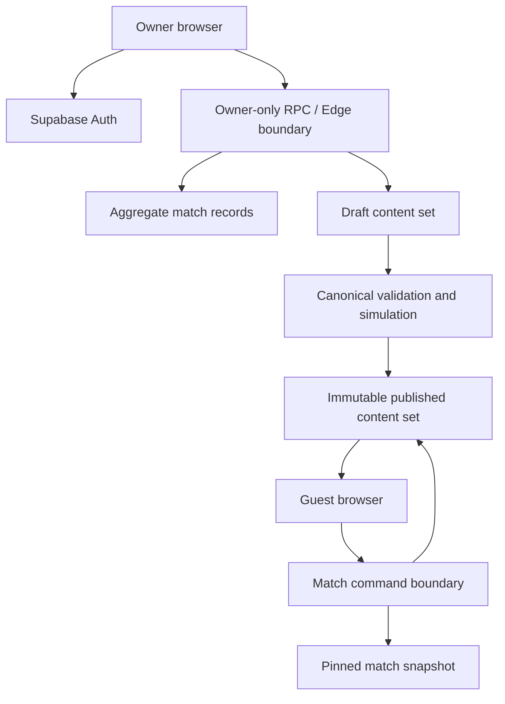
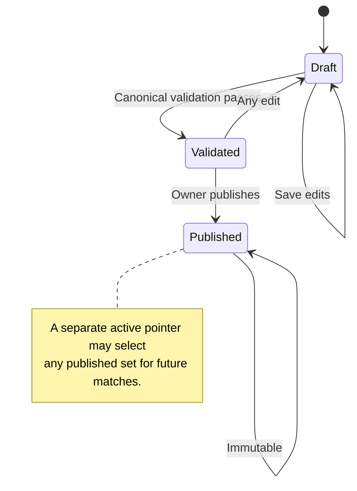

# Owner Operations Tools - Plan

## Goal Capsule

- **Objective:** Give the designated owner a secure view of multiplayer health and a safe way to draft, validate, and publish replayable card content.
- **Authority:** Existing engine validation and match snapshots remain authoritative. Published content never rewrites a running or completed match.
- **Execution profile:** Deliver the dashboard first, then the editor and match-content pinning.
- **Stop conditions:** Stop if owner authorization cannot be enforced server-side, a published deck can mutate in place, or an existing match can resolve against a different deck.
- **Tail ownership:** The implementation includes migrations, Edge Functions, browser verification, Supabase deployment, Vercel preview verification, and operational documentation.

---

## Product Contract

### Summary

Add a separate owner surface for aggregate operations data and versioned card publishing. Anonymous guest play remains unchanged, and active matches remain reproducible against the content version that created them.

### Problem Frame

Phase 3 now supports a complete anonymous multiplayer game, but the owner cannot see whether people are starting, completing, or abandoning games. Card replayability still requires editing and deploying the repository's canonical JSON by hand.

Owner tools cross a stronger trust boundary than player features. They must expose useful aggregate information without granting broad table access or leaking private match state. Card publishing must also preserve deterministic replays and prevent copy changes from altering games already in progress.

### Actors

- A1. **Owner:** The designated permanent Supabase user with `profiles.role = 'owner'`.
- A2. **Guest player:** An anonymous authenticated participant who must not gain access to owner data or draft content.
- A3. **Match runtime:** The server-authoritative resolver that must use one immutable content set for the life of a match.

### Requirements

#### Owner access and dashboard

- R1. Guest players continue to enter multiplayer without creating a permanent account.
- R2. The owner signs into a separate owner surface through passwordless email authentication.
- R3. Every owner read or mutation verifies the caller's owner role on the server.
- R4. The dashboard reports aggregate lobby, game, completion, duration, seat, and player activity trends from existing operational records.
- R5. The dashboard excludes emails, auth tokens, raw private match snapshots, and opponent-private observations.

#### Card drafts and publishing

- R6. The owner can create a draft from the current published deck and add, edit, duplicate, or remove cards.
- R7. The editor accepts only the existing card fields, targets, effects, and modifier vocabulary.
- R8. Draft validation uses the canonical content validator and identifies the card and field that failed.
- R9. Publishing creates an immutable content set with a stable version and hash; published records are never edited in place.
- R10. A published content set becomes eligible only for matches created after activation.
- R11. New modifier types, balance-rule changes, and continuous dollar allocation remain outside this plan.

### Key Flows

- F1. **Owner sign-in and overview**
  - **Trigger:** The owner opens the owner route without a valid permanent session.
  - **Actors:** A1
  - **Steps:** Request a magic link, return through an allowed redirect, verify the owner role, then load aggregate metrics.
  - **Outcome:** The owner sees the dashboard; non-owners receive no operational data.
  - **Covered by:** R2, R3, R4, R5
- F2. **Draft and publish a deck**
  - **Trigger:** The owner creates or resumes a draft.
  - **Actors:** A1
  - **Steps:** Edit card copy within the closed vocabulary, validate the full deck, review simulation evidence, and publish.
  - **Outcome:** A new immutable content set becomes the active choice for future matches.
  - **Covered by:** R6, R7, R8, R9, R10
- F3. **Resolve a pinned match**
  - **Trigger:** A player starts or resumes a match.
  - **Actors:** A2, A3
  - **Steps:** Match creation pins the active content set; later commands and browser presentation load that same set.
  - **Outcome:** Publishing another deck cannot alter the match or its replay identity.
  - **Covered by:** R9, R10

### Acceptance Examples

- AE1. **Unauthorized owner route**
  - **Covers:** R3, R5
  - **Given:** An anonymous guest or permanent non-owner session
  - **When:** The session requests dashboard metrics or draft content
  - **Then:** The server denies the request and returns no owner data
- AE2. **Invalid card draft**
  - **Covers:** R7, R8
  - **Given:** A draft card names an unknown modifier or omits a required value
  - **When:** The owner validates or publishes the draft
  - **Then:** Publishing is blocked and the failing card path is shown
- AE3. **Deck activation boundary**
  - **Covers:** R9, R10
  - **Given:** Match A started on content set 1 and the owner activates content set 2
  - **When:** Match A resumes and Match B starts
  - **Then:** Match A uses set 1 while Match B uses set 2

### Scope Boundaries

#### Deferred to Follow-Up Work

- Custom analytics events beyond the records already written by lobbies and matches
- Multi-owner roles, invitations, and granular editorial permissions
- Scheduled publishing, approval workflows, localization, and asset uploads
- Automated card-writing assistance

#### Outside This Plan

- New effect or modifier types
- Balance-rule changes or continuous dollar-allocation mechanics
- Player profiles, progression, public accounts, or player-facing history across games

---

## Planning Contract

### Key Technical Decisions

- KTD1. **Use a separate passwordless owner session.** The player entry flow stays anonymous while the owner route uses Supabase magic-link authentication with account creation disabled. This keeps administrative identity out of guest UX and relies on the existing permanent owner profile. (session-settled: user-approved — chosen over requiring every player to log in: lobby codes should remain sufficient for players.)
- KTD2. **Expose aggregates through owner-checked server boundaries.** Dashboard queries run through narrowly scoped functions or an Edge Function that verifies `profiles.role = 'owner'`; the browser receives aggregates, not broad table privileges. This follows the repository's current security-definer and service-role boundaries.
- KTD3. **Store whole-deck drafts and immutable published sets.** One JSON deck per content set keeps validation and publication atomic and avoids a relational editing model for a fixed 72-card catalog.
- KTD4. **Pin content at match creation.** Each match records its content-set identity, and both command resolution and browser presentation load that immutable set for the match lifetime.
- KTD5. **Reuse the canonical validator and simulation rules.** The owner editor cannot create a new rule vocabulary. Publishing runs canonical validation and a bounded deterministic evaluator built from the simulation harness's pure engine/agent modules; it does not invoke the Node CLI from an Edge Function. The full Phase 1 simulation remains a release gate for changes to the evaluator or engine. (session-settled: user-directed — chosen over allowing new modifiers in the editor: new mechanics require a larger rebalancing test.)
- KTD6. **Keep drafts private and serve published sets through the match boundary.** Players never query the content-set table directly. A member-scoped request returns only the immutable deck and hash pinned to that match.

### Assumptions

- The existing designated owner email remains the only owner identity for this slice.
- A permanent Supabase account and owner profile are verified before the owner route is enabled; passwordless sign-in fails closed when that account is absent.
- The bundled `cards.json` deck seeds the first published content set and remains the rollback fallback.
- Dashboard metrics are operational indicators, not billing-grade analytics.
- Content activation is immediate after a successful publish and affects only new matches.

### High-Level Technical Design

### Delivery Sequence

1. Establish owner authentication and aggregate reads.
2. Ship the dashboard using only existing operational data.
3. Add draft storage, validation, and editing.
4. Add immutable publishing and match-content pinning.
5. Verify the first published deck through a new match while an older match remains resumable.

---

## Implementation Units

### U1. Enforce the owner access boundary

- **Goal:** Add permanent owner sign-in and a reusable server-side role check without changing guest entry.
- **Requirements:** R1, R2, R3, R5; F1; AE1
- **Dependencies:** None
- **Files:** `web/owner.html`, `web/owner.js`, `web/online.js`, `supabase/migrations/<timestamp>_owner_access.sql`, `test/web-owner.test.js`
- **Approach:** Reuse the existing Supabase client bundle. Add passwordless email entry with sign-up disabled and redirect handling on the owner route. Put the role predicate in the private schema and require it from every owner-facing database function. Verify the permanent owner account/profile during rollout; otherwise leave the route disabled.
- **Patterns to follow:** `web/online-app.js` session handling; `private.is_match_member`; fixed `search_path`, explicit revokes, and authenticated grants in existing migrations.
- **Test scenarios:**
  - Covers AE1. An anonymous guest calls an owner function and receives a permission error with no data.
  - A permanent non-owner calls the same function and receives the same denial.
  - The designated owner completes the redirect and the route loads the owner shell.
  - Missing or expired links show a retryable sign-in state without exposing whether another email has an account.
  - Guest multiplayer entry still creates an anonymous session without an email prompt.
- **Verification:** Owner and guest routes preserve distinct authentication behavior, and database lint reports no new errors.

### U2. Add aggregate operations metrics

- **Goal:** Show how many lobbies and matches start, complete, remain active, and attract human participants over a selected time window.
- **Requirements:** R3, R4, R5; F1
- **Dependencies:** U1
- **Files:** `web/owner.js`, `web/owner.css`, `supabase/migrations/<timestamp>_owner_dashboard_metrics.sql`, `test/web-owner.test.js`, `test/supabase-owner-contract.test.js`
- **Approach:** Aggregate existing lobby, match, seat, action, and profile records inside the owner boundary. Return compact counts and time buckets. Keep drill-down limited to match identifiers, timestamps, status, duration, round reached, and human/AI seat counts. Give loading, empty, retryable error, and populated states distinct copy instead of rendering zeroes while a request is unresolved.
- **Patterns to follow:** Existing RPC result normalization in `web/online.js`; current `matches`, `match_seats`, and `match_actions` indexes.
- **Test scenarios:**
  - Completed and active matches produce distinct counts and durations.
  - A two-human match contributes two human seats and one unique match.
  - A cancelled lobby does not count as a started match.
  - Empty time windows return zero values and empty series.
  - Owner responses contain no email, token, snapshot, or private-view field.
- **Verification:** The dashboard reconciles against seeded records and remains readable at desktop and narrow widths.

### U3. Persist drafts and immutable content sets

- **Goal:** Store one editable deck draft and immutable published deck versions under owner-only mutation control.
- **Requirements:** R3, R6, R9
- **Dependencies:** U1
- **Files:** `supabase/migrations/<timestamp>_versioned_card_sets.sql`, `supabase/functions/owner-content/index.ts`, `test/supabase-owner-contract.test.js`, `test/owner-content-service.test.js`
- **Approach:** Seed the bundled deck as the initial published set. Store each deck as one JSON document with version, hash, lifecycle state, author, and timestamps. Allow updates only while a set is a draft. Keep activation in a separate singleton pointer so publishing and rollback never mutate an immutable published set.
- **Patterns to follow:** `supabase/functions/match-command/index.ts`; canonical hashing in `engine/content.js`; append-only match identity fields.
- **Test scenarios:**
  - The owner creates a draft copied from the active set.
  - A non-owner cannot read drafts or invoke mutations.
  - A published set rejects edits and deletion.
  - Two simultaneous publish attempts leave the active pointer referencing exactly one published set.
  - The initial migration seeds a deck whose hash matches `cards.json`.
- **Verification:** Migration constraints make published content immutable even if the UI is bypassed.

### U4. Build the closed-vocabulary card editor

- **Goal:** Let the owner edit card copy and existing effects with clear validation feedback.
- **Requirements:** R6, R7, R8, R11; F2; AE2
- **Dependencies:** U3
- **Files:** `web/owner.js`, `web/owner.css`, `supabase/functions/owner-content/index.ts`, `engine/content.js`, `test/web-owner.test.js`, `test/owner-content-service.test.js`
- **Approach:** Render native form controls from the existing card shape and known enumerations. Validate the whole draft through `validateContent` on the server and mirror only inexpensive field guidance in the browser. Keep raw JSON out of the primary editing flow. Preserve unsaved edits after a failed save or validation, disable duplicate publish requests, and return focus to the error summary.
- **Patterns to follow:** Canonical error paths in `engine/content.js`; existing card explanation and tone styles.
- **Test scenarios:**
  - The owner adds, duplicates, edits, and removes a card while preserving the required deck count.
  - Covers AE2. An unknown effect type blocks validation and identifies the card path.
  - Missing values, unknown targets, duplicate IDs, and invalid probability entries surface specific errors.
  - Copy-only changes that preserve the schema validate successfully.
  - Keyboard and screen-reader users can reach every field and error summary.
- **Verification:** The editor cannot represent or persist a modifier outside the canonical vocabulary.

### U5. Gate and publish validated content

- **Goal:** Publish only a canonical, reproducible deck with reviewable balance evidence.
- **Requirements:** R8, R9, R10, R11; F2; AE2
- **Dependencies:** U3, U4
- **Files:** `supabase/functions/owner-content/index.ts`, `sim/evaluate.js`, `sim/run.js`, `test/owner-content-service.test.js`, `docs/phase-3-foundation.md`
- **Approach:** Revalidate the stored draft at publish time, run a bounded deterministic evaluator shared with the simulation harness, calculate the canonical hash, insert the immutable set, then atomically move the active pointer. The server-safe evaluator imports only pure engine and agent modules; the Node CLI remains an offline release gate. Keep every published set readable for rollback and pinned matches.
- **Execution note:** Start with a publish-contract test that proves validation and activation are one atomic boundary.
- **Patterns to follow:** Deterministic seeds and acceptance thresholds from `npm.cmd run verify:phase1`; engine identity checks during load and replay.
- **Test scenarios:**
  - A validated draft publishes with a stable hash and becomes the sole active set.
  - A draft changed after validation must validate again before publish.
  - A failed bounded evaluation leaves the prior active pointer unchanged.
  - Repeating the same publish request does not create duplicate active versions.
  - Activating a new set retains the previous published set for rollback.
- **Verification:** Every published record has successful validation evidence, a unique version, and a canonical hash.

### U6. Pin matches and clients to one content set

- **Goal:** Resolve and present every match against the deck version selected at match creation.
- **Requirements:** R9, R10; F3; AE3
- **Dependencies:** U3, U5
- **Files:** `multiplayer/service.js`, `supabase/functions/match-command/index.ts`, `supabase/migrations/<timestamp>_match_content_identity.sql`, `web/online-app.js`, `web/online.js`, `test/multiplayer-service.test.js`, `test/web-online.test.js`
- **Approach:** Record the active content-set identity in the match transaction. Resolve that set before each command and expose its identity in the filtered view. A member-scoped command returns only the pinned published deck and hash after verifying match membership; it never exposes drafts or other published sets. Cache the validated result in each browser session and retain the bundled deck as a controlled fallback for pre-migration matches.
- **Execution note:** Characterize an existing match before changing content resolution, then prove old and new matches diverge only by their pinned deck.
- **Patterns to follow:** Match snapshot identity validation; `commit_match_start`; filtered `match_views`; browser content validation.
- **Test scenarios:**
  - Covers AE3. A running match continues on its original deck after a new set activates.
  - A newly started match pins the newly active set.
  - Reconnect loads the pinned set before staging cards or Board Book entries.
  - Missing or hash-mismatched pinned content fails safely instead of resolving with another deck.
  - A non-member cannot fetch a match's pinned deck, and a member cannot request an arbitrary draft or published version.
  - A pre-migration match uses the bundled fallback and remains resumable.
- **Verification:** Replay identity, server resolution, card presentations, and Board Book history agree on the same content set.

### U7. Roll out and verify owner operations

- **Goal:** Deploy the owner boundary and content lifecycle with observable rollback points.
- **Requirements:** R1-R11
- **Dependencies:** U2, U5, U6
- **Files:** `README.md`, `docs/phase-3-foundation.md`, `test/web-server.test.js`
- **Approach:** Document the owner redirect configuration, dashboard reconciliation queries, deck rollback procedure, and activation checks. Verify one old match and one new match across a deck activation before production sign-off.
- **Test scenarios:**
  - Production redirects return the owner to the approved domain and reject unlisted destinations.
  - The deployed dashboard totals reconcile with direct owner-only aggregate queries.
  - A rollback reactivates a prior immutable set for new matches without changing existing matches.
  - Anonymous players can still create, join, and complete a lobby after owner tools deploy.
- **Verification:** Supabase advisors, Edge logs, Vercel preview checks, and the old/new-match activation scenario are clean.

---

## System-Wide Impact

- **Authentication:** Adds a permanent owner flow while preserving anonymous player sessions.
- **Authorization:** Introduces owner-only aggregates and mutations; no browser receives service-role credentials.
- **Persistence:** Adds immutable content history and a match-to-content reference.
- **Runtime:** Match commands resolve content per match instead of assuming one bundled deck.
- **Browser:** Owner tools gain a separate route; multiplayer caches the pinned deck for presentations.
- **Operations:** Published content becomes a production change with validation evidence and a rollback pointer.

---

## Risks and Dependencies

- **Authorization drift:** A badge or client-side check is insufficient. Mitigation: enforce the role at every database or Edge boundary and test both anonymous and permanent non-owner callers.
- **Content mismatch:** Server and browser could load different decks. Mitigation: carry one content-set identity and hash through match creation, views, reconnect, and replay validation.
- **Publish race:** Concurrent activation could leave multiple active sets. Mitigation: use one atomic publish transaction and a database uniqueness constraint.
- **Analytics ambiguity:** Anonymous users can create multiple profiles, so "unique players" means unique anonymous account IDs, not verified people. Label the metric accordingly.
- **Large deck payload:** A full deck is larger than current match views. Fetch it once by content-set identity and cache it instead of embedding it in every realtime update.

---

## Verification Contract

| Gate | Applies to | Done signal |
|---|---|---|
| `npm.cmd run validate:content` | U3-U6 | Bundled and edited content passes canonical validation |
| `npm.cmd test` | U1-U7 | Unit, service, browser-contract, and server-route tests pass |
| `npm.cmd run verify:phase1` | U5-U6 | Deterministic engine and balance acceptance remains within configured thresholds |
| `npx.cmd supabase db lint --linked --schema public,private --level warning --fail-on error` | U1-U3, U6 | No new database lint errors |
| Supabase dry-run and linked migration verification | U1-U3, U6 | Local and remote migration histories agree |
| Two-session browser acceptance | U1, U2, U6, U7 | Owner denial/entry, dashboard totals, deck activation, old-match resume, and new-match creation work on the preview |
| Production smoke and log review | U7 | No owner authorization, match-content, or publish errors appear after release |

---

## Definition of Done

- Every requirement R1-R11 is implemented or explicitly returned to planning.
- U1-U7 satisfy their test scenarios and verification outcomes.
- Owner authorization is enforced server-side for every metric, draft, validation, and publish request.
- Dashboard responses contain aggregate operational data only.
- Published decks are immutable, versioned, hashed, and reversible for future matches.
- Every match resolves and renders against one pinned content set for its full lifecycle.
- Guest lobby entry and complete multiplayer play remain unchanged.
- The production owner redirect, Supabase migrations, Edge Functions, and Vercel deployment are verified.
- Experimental migrations, dead editor paths, and abandoned content-loading approaches are removed before completion.

---

## Sources and Research

- `docs/phase-3-foundation.md`
- `docs/plans/2026-07-16-001-feat-phase-2-solo-campus-ui-plan.md`
- `supabase/migrations/20260719032631_phase_3_lobby_foundation.sql`
- `supabase/migrations/20260721015751_match_runtime.sql`
- `supabase/functions/match-command/index.ts`
- `engine/content.js`
- [Supabase passwordless email authentication](https://supabase.com/docs/guides/auth/auth-email-passwordless)
- [Supabase redirect URL configuration](https://supabase.com/docs/guides/auth/redirect-urls)
- [Supabase Row Level Security](https://supabase.com/docs/guides/database/postgres/row-level-security)
